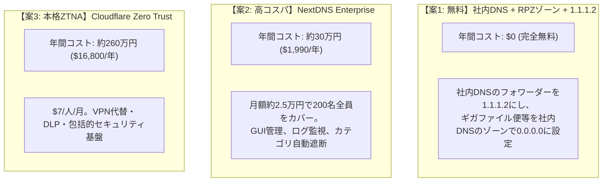
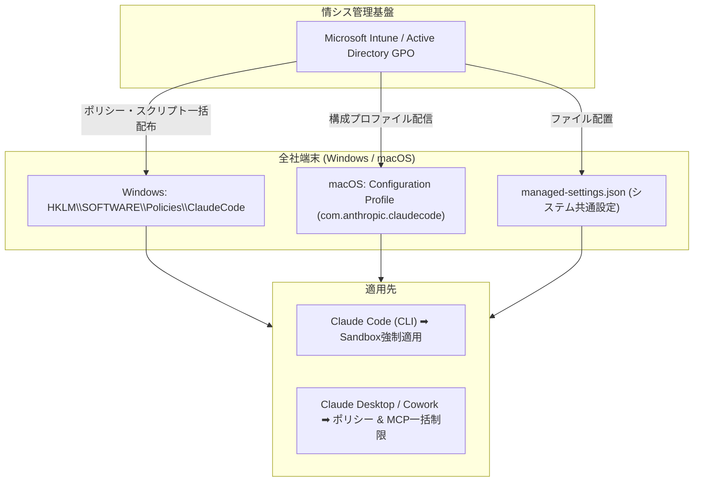

# AIエージェントセキュリティとローカルサンドボックス化ガイド

## 1. 背景と概要

2026年に入り、**正規の社内AIエージェントや開発環境に組み込まれたAIツールを悪用したサイバー攻撃・情報漏洩インシデント**が急増しています。

従来のEDRやセキュリティ監視ツールは、「スクリプト実行」「ファイル探索」「パッケージインストール」などを開発者の正当な通常業務プロセスとみなすため、正規の権限を持つAIエージェントを悪用した攻撃を検知することが困難です。

本ドキュメントでは、主要な脅威に対する**「200名規模の企業におけるコスト試算と最適構成」**、**「セキュリティDNSの比較」**、**「Microsoft Intune による一括配布」**、**「Claude Code 公式 Sandbox 機能」**、**「agy の bwrap サンドボックス化」**を体系的に記録します。

---

## 2. 200名規模の企業におけるコスト試算と最適アーキテクチャ

200名規模の企業で「マルウェア・C2C遮断」および「ギガファイル便等のファイル共有遮断」を実現する場合の**3つの選択肢と年間費用比較**です。



### 200名規模の費用・特徴比較

| 手法 | **年間コスト (200名)** | **月額換算** | 主な特徴・メリット | 運用のポイント |
| :--- | :--- | :--- | :--- | :--- |
| **案1: 社内DNS活用 + 1.1.1.2** (最安) | **$0 (完全無料)** | **0 円** | **追加費用ゼロ**。今あるActive DirectoryやBIND DNSの設定変更だけで即日導入可能。 | 日本のファイル便ドメイン（gigafile.nu等）を社内DNSのブロックゾーンに手動登録。 |
| **案2: NextDNS (Enterprise)** (高コスパ) | **$1,990 / 年**<br/>(約30万円/年) | **約 2.5 万円 / 月** | **驚異的な低コスト**（1人あたり月約120円）。直感的なWeb画面でログ確認・カテゴリ自動更新。 | 社内DNSのフォワーダーをNextDNSに向けるだけ。 |
| **案3: Cloudflare Zero Trust (Standard)** | **$16,800 / 年**<br/>(約260万円/年) | **約 22 万円 / 月**<br/>($7/人/月) | DNSだけでなく、VPN代替（ZTNA）、HTTPインスペクション、DLPまで含む本格基盤。 | 予算が年間数百万円確保できる場合向け。 |

---

### 案1（追加費用 0 円）の社内DNS構築手順

Windows Server（Active Directory DNS）または Linux（BIND / Unbound）がある場合、**追加予算なしで200名を完全保護**できます。

#### ステップ1: 社内DNSのフォワーダー設定
* 社内DNSの転送先（Forwarder）に **`1.1.1.2`** または **`9.9.9.9`** を設定。
* ➡ **マルウェア・ランサムウェア・不正C2Cサーバーへの通信が自動遮断**。

#### ステップ2: ギガファイル便等のブラックホールゾーン作成
社内DNSサーバー上で、遮断したいドメインの新規前方参照ゾーンを作成し、レコードを `0.0.0.0` に設定します。
* 例（Windows DNS）:
  1. `DNS マネージャー` ➡ `前方参照ゾーン` ➡ `新規ゾーン` で `gigafile.nu` を作成。
  2. レコードなし（または `@ A 0.0.0.0`）を登録。
* ➡ **全社員が `gigafile.nu` にアクセスしても `0.0.0.0` に解決され、アップロードが物理的に遮断**されます。

---

## 3. 日本のファイル転送サービス（ギガファイル便等）への対応状況

### ブロック推奨ドメインリスト
```text
gigafile.nu          # ギガファイル便
firestorage.jp       # firestorage
firestorage.com
datadeliver.net      # データ便
data-bin.net
okurinbo.com         # おくりん坊
tenpu.me             # tenpu
file.io              # 海外匿名アップローダ
transfer.sh
catbox.moe
0x0.st
```

---

## 4. Microsoft Intune / GPO による全社一括配布



---

## 5. Claude Code 公式 Sandbox 機能の使い方（会社環境向け）

### 有効化手順（settings.json）
`~/.claude/settings.json` または `.claude/settings.json`:
```json
{
  "sandbox": {
    "enabled": true,
    "autoAllowBashIfSandboxed": true,
    "allowUnsandboxedCommands": false,
    "network": {
      "allowedDomains": [
        "github.com",
        "api.github.com",
        "registry.npmjs.org",
        "npm.flatt.tech",
        "*.mycompany.com",
        "*.sharepoint.com",
        "drive.google.com"
      ]
    }
  }
}
```

---

## 6. このPC（Linux環境）での設定手順とロールバック

### ① agy 向け bwrap 透過ラッパー

```bash
# 設定
sudo tee /etc/apparmor.d/bwrap << 'EOF'
abi <abi/4.0>,
include <tunables/global>

profile bwrap /usr/bin/bwrap flags=(unconfined) {
  userns,
}
EOF
sudo systemctl reload apparmor

mv ~/.local/bin/agy ~/.local/bin/agy-real
cat << 'EOF' > ~/.local/bin/agy
#!/usr/bin/env bash
set -euo pipefail
TARGET_DIR="$(pwd)"
USER_HOME="$HOME"
REAL_AGY="$USER_HOME/.local/bin/agy-real"

exec /usr/bin/bwrap \
  --ro-bind / / \
  --dev /dev \
  --proc /proc \
  --tmpfs /tmp \
  --tmpfs "$USER_HOME" \
  --ro-bind-try "$USER_HOME/.gemini" "$USER_HOME/.gemini" \
  --bind-try "$USER_HOME/.gemini/antigravity-cli" "$USER_HOME/.gemini/antigravity-cli" \
  --bind-try "$USER_HOME/.gemini/config" "$USER_HOME/.gemini/config" \
  --bind-try "$USER_HOME/.gemini/skills" "$USER_HOME/.gemini/skills" \
  --ro-bind-try "$USER_HOME/.local" "$USER_HOME/.local" \
  --ro-bind-try "$USER_HOME/.nvm" "$USER_HOME/.nvm" \
  --ro-bind-try "$USER_HOME/.bun" "$USER_HOME/.bun" \
  --ro-bind-try "$USER_HOME/.gitconfig" "$USER_HOME/.gitconfig" \
  --ro-bind-try "$USER_HOME/.orca-remote" "$USER_HOME/.orca-remote" \
  --ro-bind-try "$USER_HOME/.orca-relay" "$USER_HOME/.orca-relay" \
  --bind "$TARGET_DIR" "$TARGET_DIR" \
  --chdir "$TARGET_DIR" \
  --unshare-pid \
  -- "$REAL_AGY" "$@"
EOF
chmod +x ~/.local/bin/agy
```

```bash
# ロールバック
rm -f ~/.local/bin/agy && mv ~/.local/bin/agy-real ~/.local/bin/agy
```

---

### ② Cloudflare 1.1.1.2 セキュアDNS

```bash
# 設定
sudo mkdir -p /etc/systemd/resolved.conf.d
sudo tee /etc/systemd/resolved.conf.d/cloudflare-security.conf << 'EOF'
[Resolve]
DNS=1.1.1.2 1.0.0.2 2606:4700:4700::1112 2606:4700:4700::1002
FallbackDNS=1.1.1.1 1.0.0.1
DNSOverTLS=opportunistic
EOF
sudo systemctl restart systemd-resolved
```

```bash
# ロールバック
sudo rm -f /etc/systemd/resolved.conf.d/cloudflare-security.conf
sudo systemctl restart systemd-resolved
```
