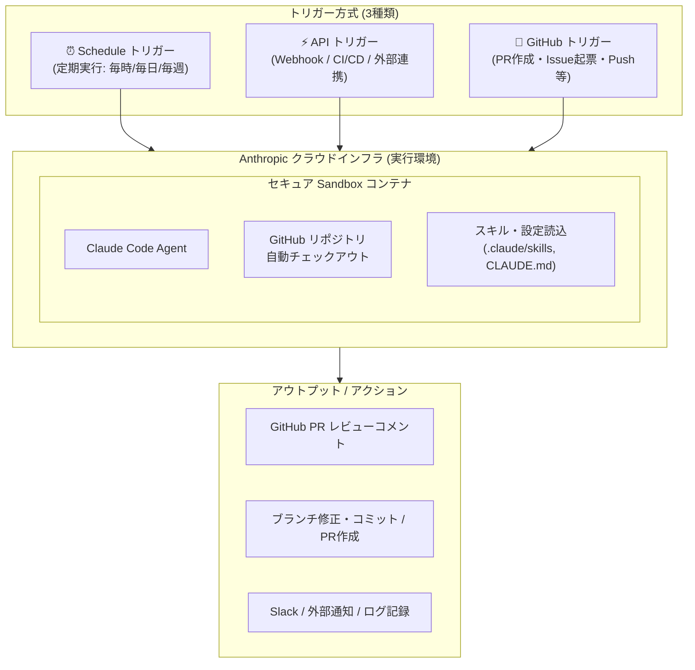
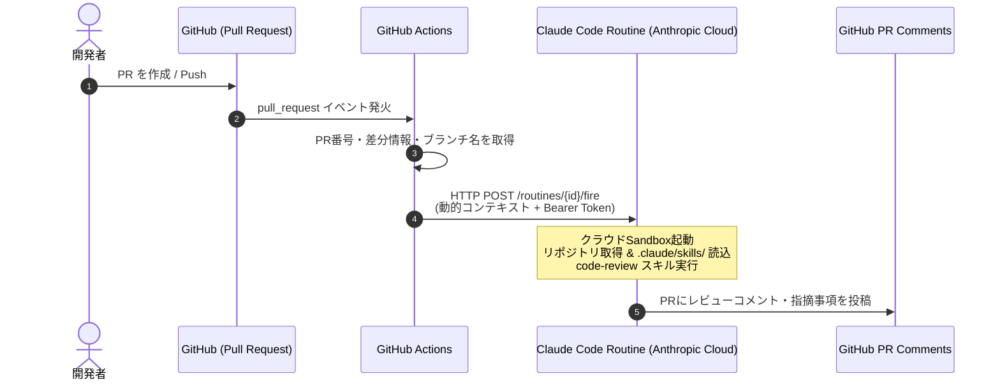
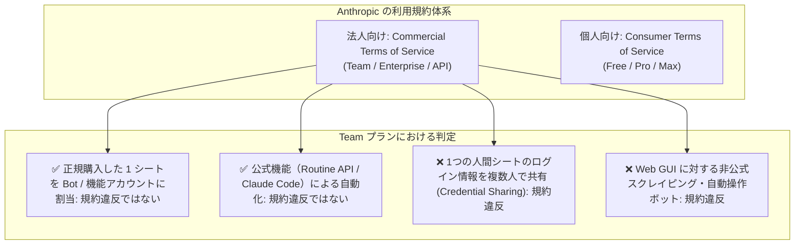
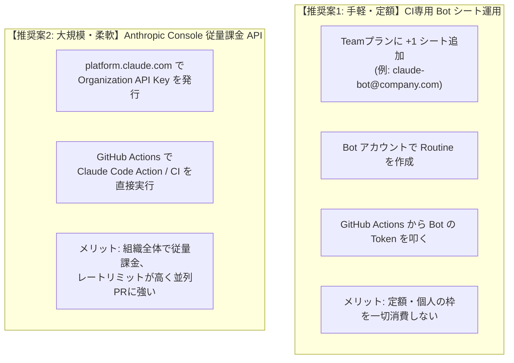
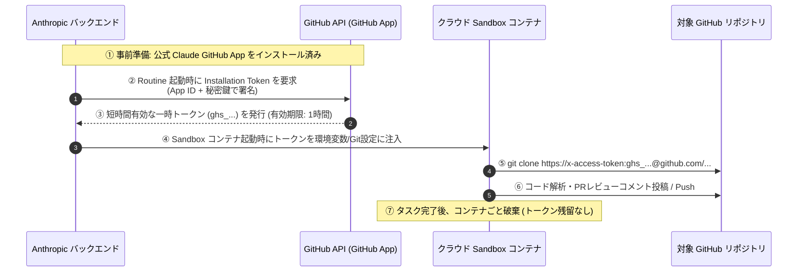
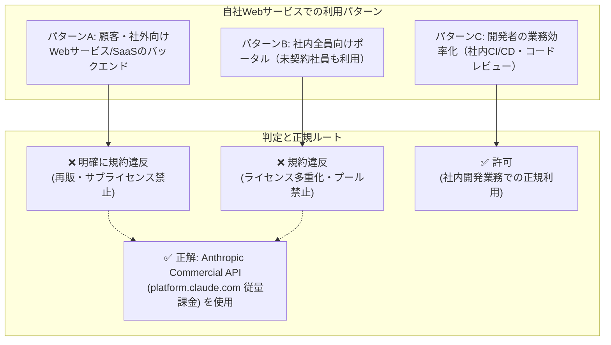
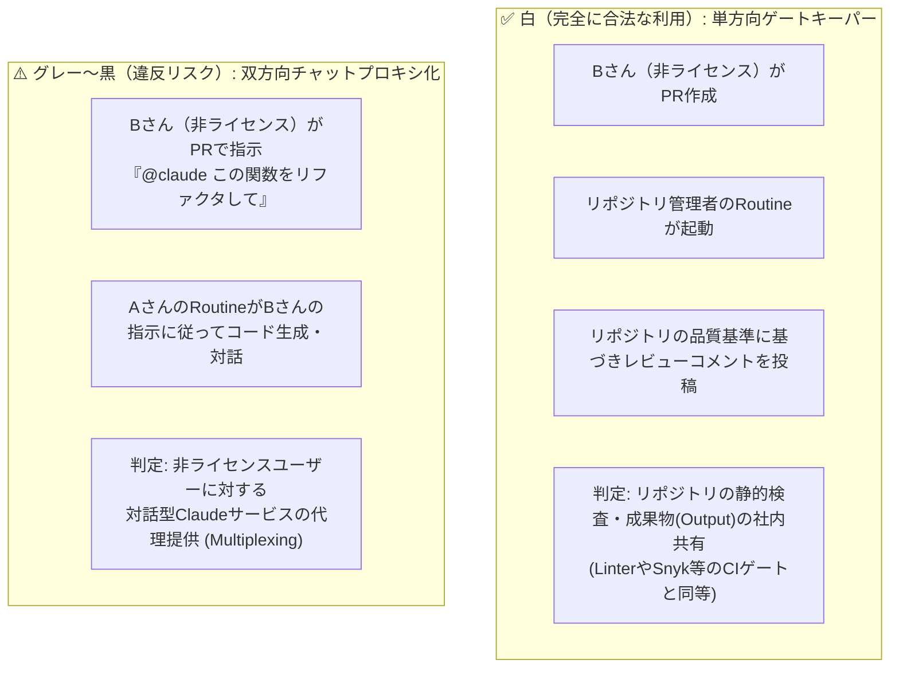

# Claude Code Routine機能 徹底解説（APIトリガー・GitHub連携・実行環境）

## 1. 概要：Claude Code Routine（ルーチン）とは

**Claude Code Routine** は、Anthropic が提供する **「クラウド常駐型の自律エージェント自動化機能」** です。

あらかじめ設定した「プロンプト（指示）」「対象リポジトリ」「連携コネクタ（MCP / Tools）」「スキル（`.claude/skills/`）」のセットをパッケージ化し、開発者のローカル環境（PC/ターミナル）を起動していなくても、**Anthropic のクラウドインフラ上で完全自動実行** させることができます。



---

## 2. Routineの実行環境はどこになるのか？

### 実行環境のアーキテクチャ

| 項目 | 詳細・仕様 |
| :--- | :--- |
| **実行基盤** | **Anthropic Managed Cloud Sandbox（クラウドコンテナ）** |
| **ローカルPCの状態** | **完全不要**（PCの電源が切れていても、スリープ中でも実行される） |
| **リポジトリ取得** | 連携した **GitHub App** の認可に基づき、実行時にサンドボックス内へ一時的にクローンされる |
| **設定の読み込み** | リポジトリ直下の `CLAUDE.md`、`.claude/skills/`、`.claude/settings.json` がそのまま適用される |
| **認証・セキュリティ** | リポジトリごとに独立した一時コンテナで実行され、タスク完了後に安全に破棄される |
| **実行ログの確認** | `https://claude.ai/code/routines` の「Sessions」または対象ルーチンの実行履歴画面からリアルタイム確認可能 |

> [!NOTE]
> 開発者のローカル環境にあるグローバル設定（`~/.claude/` やローカルの環境変数）はクラウド環境には自動引き継ぎされません。クラウドRoutineで利用するスキルや指示は、必ず **リポジトリ内の `.claude/` または Routine 作成画面のプロンプト** に記述してください。

---

## 3. トリガーの種類と「APIトリガー」の仕組み

Routine には3つの起動トリガーが用意されています。

1. **Schedule トリガー**: 定期バッチ（例: 毎朝のIssueトリアージ、週次の依存関係アップデート、ドキュメント更新）
2. **GitHub トリガー**: GitHubイベント直接検知（PRオープン、リリース作成など）
3. **API トリガー**: 外部システムから HTTP POST リクエストを送信してオンデマンド起動

### APIトリガーの詳細仕様

APIトリガーを有効化すると、ルーチンごとに固有の **エンドポイント URL** と **専用 Bearer Token** が発行されます。

* **Endpoint URL 形式**:
  ```text
  POST https://api.anthropic.com/v1/claude_code/routines/{ROUTINE_ID}/fire
  ```
* **認証ヘッダー**:
  * `Authorization: Bearer <ROUTINE_BEARER_TOKEN>`
  * ※ 通常の Claude API Key (`sk-ant-api03-...`) ではなく、Routine 専用の Bearer Token (`sk-ant-oat01-...` 等) を使用します。
  * ※ トークンは作成時に1度だけ表示されるため、必ずセキュアに保存してください。
* **リクエストペイロード（JSON）**:
  * `{ "text": "追加のコンテキストや動的指示" }` を渡すことで、ルーチン定義時のプロンプトに動的なパラメータやイベント情報を注入できます。

#### curl コマンドによる呼び出し例

```bash
curl -X POST https://api.anthropic.com/v1/claude_code/routines/<ROUTINE_ID>/fire \
  -H "Authorization: Bearer <YOUR_ROUTINE_TOKEN>" \
  -H "anthropic-beta: experimental-cc-routine-2026-04-01" \
  -H "anthropic-version: 2023-06-01" \
  -H "Content-Type: application/json" \
  -d '{
    "text": "Pull Request #42: Feature user auth (Branch: feature/auth) needs code review."
  }'
```

---

## 4. GitHub PR作成時に `code-review` スキルを実行させる構成

GitHub で PR が作成（またはコミット追加）された際に、Claude Code Routine の API トリガーを叩いて `code-review` スキルを実行させるフローです。



### ステップ1: リポジトリ内に `code-review` スキルを用意

リポジトリ内の `.claude/skills/code-review.md` にレビュー基準や出力形式を定義しておきます。

```markdown
<!-- .claude/skills/code-review.md -->
# Code Review Skill

## 目的
提供された Pull Request の変更差分をレビューし、セキュリティ、保守性、パフォーマンス、型安全性、テストの網羅性を検証する。

## レビュー観点
1. **セキュリティ脆弱性**: インジェクション、認可不備、機密情報のハードコードがないか
2. **コード品質と設計**: 単一責任の原則、重複コード、可読性
3. **TypeScript / 型安全性**: any型の濫用回避、厳格な型付け
4. **テスト**: 必要なテストケースが追加・更新されているか

## 出力・アクション
- GitHub PR に対し、具体的な改善提案コードと合わせてレビューコメントを投稿すること。
- 重大な問題がない場合は LGTM と要約を記述すること。
```

---

### ステップ2: Claude Code Routine の作成と設定

1. **`https://claude.ai/code/routines`** にアクセスします。
2. **「Create Routine」** をクリックします。
3. **設定項目**:
   * **Name**: `PR Code Review Routine`
   * **Repository**: 対象の GitHub リポジトリを選択（GitHub App 認可が必要）
   * **Prompt**:
     ```text
     You are an automated code review assistant.
     When triggered, read the Pull Request information provided in the input context.
     Execute the `.claude/skills/code-review.md` skill on the specified Pull Request.
     Post your review findings, suggestions, and summary directly as comments on the GitHub Pull Request.
     ```
   * **Trigger**: **API Trigger** を選択
4. **Bearer Token の生成・保存**:
   * 表示された `Bearer Token` と `Endpoint URL` をコピーします。
   * ※ トークンは再表示できないため大切に保管します。

---

### ステップ3: GitHub Secrets にトークンを登録

GitHub リポジトリの **Settings > Secrets and variables > Actions** にて以下を登録します:

* `CLAUDE_ROUTINE_TOKEN`: ステップ2で取得した Bearer Token (`<YOUR_ROUTINE_TOKEN>`)
* `CLAUDE_ROUTINE_ID`: 作成した Routine の ID（URL内の `{ROUTINE_ID}`）

---

### ステップ4: GitHub Actions ワークフローの作成

リポジトリの `.github/workflows/claude-routine-review.yml` に以下を配置します。

```yaml
name: Trigger Claude Code Review Routine

on:
  pull_request:
    types: [opened, synchronize, reopened]

jobs:
  trigger-claude-routine:
    runs-on: ubuntu-latest
    permissions:
      contents: read
      pull-requests: write

    steps:
      - name: Trigger Claude Code Routine via API
        env:
          ROUTINE_ID: ${{ secrets.CLAUDE_ROUTINE_ID }}
          ROUTINE_TOKEN: ${{ secrets.CLAUDE_ROUTINE_TOKEN }}
          PR_NUMBER: ${{ github.event.pull_request.number }}
          PR_TITLE: ${{ github.event.pull_request.title }}
          PR_URL: ${{ github.event.pull_request.html_url }}
          HEAD_BRANCH: ${{ github.event.pull_request.head.ref }}
          BASE_BRANCH: ${{ github.event.pull_request.base.ref }}
        run: |
          PAYLOAD=$(jq -n \
            --arg pr "$PR_NUMBER" \
            --arg title "$PR_TITLE" \
            --arg url "$PR_URL" \
            --arg head "$HEAD_BRANCH" \
            --arg base "$BASE_BRANCH" \
            '{
              text: "Please perform a code review on Pull Request #\($pr): \"\($title)\". PR URL: \($url), Head Branch: \($head), Base Branch: \($base). Use the .claude/skills/code-review.md skill and post comments directly on the PR."
            }')

          echo "Triggering Claude Code Routine for PR #${PR_NUMBER}..."

          HTTP_STATUS=$(curl -s -o response.json -w "%{http_code}" \
            -X POST "https://api.anthropic.com/v1/claude_code/routines/${ROUTINE_ID}/fire" \
            -H "Authorization: Bearer ${ROUTINE_TOKEN}" \
            -H "anthropic-beta: experimental-cc-routine-2026-04-01" \
            -H "anthropic-version: 2023-06-01" \
            -H "Content-Type: application/json" \
            -d "$PAYLOAD")

          echo "HTTP Response Code: $HTTP_STATUS"
          cat response.json

          if [ "$HTTP_STATUS" -ne 200 ] && [ "$HTTP_STATUS" -ne 202 ]; then
            echo "Failed to trigger Claude Code Routine"
            exit 1
          fi
```

---

## 5. まとめ・設定チェックリスト

| 設定箇所 | 実施内容 | 確認ポイント |
| :--- | :--- | :--- |
| **リポジトリ** | `.claude/skills/code-review.md` を作成・コミット | レビュー基準や出力フォーマットが明確に記載されているか |
| **Claude Web UI** | `claude.ai/code/routines` で新規作成 | リポジトリ連携・プロンプト・APIトリガー設定とトークン取得 |
| **GitHub Secrets** | `CLAUDE_ROUTINE_TOKEN`, `CLAUDE_ROUTINE_ID` 登録 | プレーンテキストでコミットせず Secrets で安全に管理 |
| **GitHub Actions** | `.github/workflows/claude-routine-review.yml` 配置 | `pull_request` イベントで `curl` POST が正常に 200/202 を返すか |
| **動作確認** | テストPRを作成 | Actionsログおよび `claude.ai/code/routines` の Session ログを確認 |

---

## 6. Teamプランにおける使用量消費・利用規約（ToS）と推奨アーキテクチャ

### 6.1 特定ユーザーの使用量が消費される問題

Claude Code Routine は、**「その Routine を作成したユーザー（Seat）」のアカウントコンテキスト** で Anthropic クラウド上で実行されます。

そのため、Team プランの特定の個人メンバー（例: Aさん）のアカウントで Routine を作成し、それを GitHub Actions で全社・全メンバーの PR ごとにトリガーした場合、以下の問題が発生します。

1. **Aさんの個人使用量枠（5時間ローリング枠・週次コンピュート時間上限）が激しく消費される**:
   * CI/CD の PR レビューが走るたびに、Aさんの利用枠が削られます。
   * 結果として、Aさん自身が日常業務で Claude（Web / CLI）を使おうとした際に「利用上限に達しました（Rate limit reached）」とブロックされてしまいます。
2. **監査ログ・トレーサビリティの混乱**:
   * 他の開発者が作成した PR に対するレビューやコミットが、すべて A さん名義のアクティビティとして記録されてしまいます。

---

---

## 6. Teamプランにおける使用量消費・利用規約（ToS）と推奨アーキテクチャ

### 6.1 特定ユーザーの使用量が消費される問題

Claude Code Routine は、**「その Routine を作成したユーザー（Seat）」のアカウントコンテキスト** で Anthropic クラウド上で実行されます。

そのため、Team プランの特定の個人メンバー（例: Aさん）のアカウントで Routine を作成し、それを GitHub Actions で全社・全メンバーの PR ごとにトリガーした場合、以下の問題が発生します。

1. **Aさんの個人使用量枠（5時間ローリング枠・週次コンピュート時間上限）が激しく消費される**:
   * CI/CD の PR レビューが走るたびに、Aさんの利用枠が削られます。
   * 結果として、Aさん自身が日常業務で Claude（Web / CLI）を使おうとした際に「利用上限に達しました（Rate limit reached）」とブロックされてしまいます。
2. **監査ログ・トレーサビリティの混乱**:
   * 他の開発者が作成した PR に対するレビューやコミットが、すべて A さん名義のアクティビティとして記録されてしまいます。

---

### 6.2 Teamプランで「ボットユーザー」を作成するのは規約違反か？

結論から言うと、**Team プラン（Commercial Terms）で正規に 1 シートを追加購入し、Bot / サービスアカウントとして割り当てること自体は規約違反になりません。**

#### 規約（Terms of Service）上の詳細な法的根拠

Anthropic の規約体系は、無料/Pro/Max などの個人向け（Consumer Terms）と、Team/Enterprise などの法人向け（Commercial Terms）で明確に分かれています。



| 項目 | 判定 | 規約上の理由 |
| :--- | :--- | :--- |
| **正規の追加シートを Bot 用にする**<br/>(`claude-bot@company.com` に1席割当) | **✅ 違反ではない** | 商用規約（Commercial Terms）では、購入した「Authorized Users（ライセンス席数）」の範囲内でアカウントを組織管理下で割り当てることが認められています。Anthropic公式サポートでも、Primary Ownerやシステム用に機能アカウントを用いる運用が認められています。 |
| **公式 Routine API の呼び出し** | **✅ 違反ではない** | Anthropic が公式に提供している API トリガー機能を用いた自動実行であり、正規の利用範囲です。 |
| **ログイン情報の使い回し**<br/>(Credential Sharing) | **❌ 規約違反** | 1つのアカウントのパスワードや2FAを複数人の人間で共有することは明確に禁止されています。 |
| **非公式なWebスクレイピング/ボット** | **❌ 規約違反** | Web画面（claude.ai）をブラウザ自動化（Selenium/Puppeteer等）で不正に操作・スクレイピングする行為は禁止されています。 |

---

### 6.3 ボットシート運用の実務上の注意点（壁）

規約上は問題ありませんが、Team プランで Bot シートを運用する際には以下の **実務上の制約・落とし穴** があります。

1. **5時間のローリング利用枠（Rate Limit）がある**:
   * Bot シートであっても「1シートあたりの対話利用枠」が適用されます。
   * 短時間に PR が集中（5〜10件以上同時作成など）した場合、Bot シートの 5時間枠が枯渇し、CI のレビュー処理が失敗・停止するリスクがあります。
2. **企業 SSO（IdP / SAML）の制約**:
   * 組織で Google Workspace や Okta、Microsoft Entra ID による SSO（シングルサインオン）を強制している場合、Bot 用メールアドレスにも IdP アカウントやライセンスが必要になります。
3. **コスト効率のトレードオフ**:
   * 月額 $25〜$30 / 月（年間契約）の追加シート費用が固定で発生します。PR が少ない月でも固定費がかかります。

---

### 6.4 チーム運用のための2つの推奨アプローチ



#### 推奨案の比較

| 項目 | **案1: CI専用 Bot シート（Teamプラン内）** | **案2: Anthropic Console 従量課金 API** |
| :--- | :--- | :--- |
| **課金方式** | **定額制**（月額 $25〜$30 / 月） | **従量課金制**（トークン消費量に応じた Pay-as-you-go） |
| **個人の利用枠影響** | **影響ゼロ**（Bot 専用の独立枠で消費） | **影響ゼロ**（組織の API クレジットで消費） |
| **利用規約・監査** | **完全準拠**（正規の Bot アカウントとして1シート契約） | **完全準拠**（組織単位の正式な API 利用） |
| **レートリミット耐性** | 5時間枠あり（同時に大量のPRが来ると待機発生の可能性） | **非常に高い**（API Tier に応じた高スループット） |
| **おすすめケース** | PR頻度が中規模で、**月額費用を定額に固定したい**場合 | PRが毎日大量に作成される中〜大規模開発チーム |

---

## 7. クラウドSandbox環境におけるGitHub認証の仕組み

Claude のクラウドSandbox環境でリポジトリを `git clone` したり、ブランチのPush、PRコメント投稿を行う際の **GitHub認証の仕組み** は以下の通りです。

ユーザーが個人のアクセストークン（PAT）や SSH 秘密鍵をSandboxに渡す必要はなく、**「GitHub App 連携」による一時トークンの自動注入** でセキュアに動作します。



---

### 認証の 4つの重要ポイント

| 項目 | 詳細・セキュリティ仕様 |
| :--- | :--- |
| **1. 認証の主体** | **公式「Claude GitHub App」** を通じた Organization / リポジトリ認可 |
| **2. トークン種別** | **GitHub App Installation Access Token (`ghs_...`)**<br/>※静的な個人トークン（PAT）ではなく、実行ごとに生成される一時トークン |
| **3. トークンの有効期間** | **最大1時間（短命トークン）**。セッション終了とともにコンテナごと破棄 |
---

## 8. Teamサブスクリプションを自社Webサービスに組み込むのは規約違反か？

自社の Web サービス（SaaS、顧客向けプロダクト、社内向けポータルなど）のバックエンド AI として **Team サブスクリプションのシートアカウント（Web/Routine/Claude Code）を利用・組み込む行為の規約判定** について解説します。

---

### 8.1 結論：ユースケース別の規約判定



| ユースケース | Team プランのシート利用 | Anthropic 公式 API 利用 | 規約上の理由 |
| :--- | :---: | :---: | :--- |
| **① 顧客・社外向け Web サービス / SaaS に組み込む** | ❌ **違反** | ✅ **正規利用** | サブスクリプションの**再販（Reselling）・サブライセンス（Sublicensing）・第三者への再配布の禁止**に抵触。外部サービス組み込みには Commercial API が必須。 |
| **② 社内ポータルを作り、未契約の全社員に使わせる** | ❌ **違反** | ✅ **正規利用** | 1つのシートをプロキシ化して複数人で共有する**ライセンス多重化（Multiplexing / Account Pooling）の禁止**に抵触。 |
| **③ 開発チームの CI/CD・コード自動レビューに使う** | ✅ **許可** | ✅ **正規利用** | 契約組織内の開発業務・運用自動化（Internal Business Operations）の範囲内であるため合法。 |

---

### 8.2 Anthropic 商用利用規約（Commercial Terms）の具体的条項

Anthropic の [Commercial Terms of Service](https://www.anthropic.com/legal/commercial-terms) において、以下の行為が明示的に制限・禁止されています。

1. **再販・サブライセンス・第三者提供の禁止 (Restrictions on Sublicensing / Reselling)**:
   * **条項の趣旨**: Team / Enterprise プラン（Claude for Work）は、**「顧客企業内の承認された従業員（Authorized Users）が直接業務で利用すること（Internal Business Purposes）」** を前提とした契約です。
   * 自社 Web サービスのバックエンドとして Team シートを組み込み、エンドユーザー（顧客）に Claude の応答を提供する行為は、**「Claude サービスの再販（Resale）または無許可の第三者提供」** とみなされ、重大な契約違反となります。
2. **ライセンスの多重化・プーリングの禁止 (No Multiplexing / Pooling)**:
   * 1 つのライセンスシート（または特定ユーザーの認証情報）を API プロキシやサーバーの背後に隠し、ライセンスを持たない複数の人間（社内の他部署メンバーや外部ユーザー）が実質的に利用できるようにするアーキテクチャ（Multiplexing）は禁止されています。
3. **製品組み込みのための正式な手段 = 「Anthropic Commercial API」**:
   * 自社アプリケーションや Web サービスに Claude のモデルを組み込んでエンドユーザーに提供するユースケースのために、Anthropic は **「Anthropic Commercial API（`platform.claude.com`）」** を提供しています。
   * Web サービス開発においては、サブスクリプションシートではなく **API 契約（API Terms）に基づき、従量課金 API キーを発行して実装すること** が義務付けられています。

---

### 8.3 まとめ：Webサービス開発時の正しいアーキテクチャ

* **自社プロダクト / Web サービスに AI 機能を組み込む場合**:
  必ず **Anthropic Console（`platform.claude.com`）** で API キーを発行し、従量課金（Pay-as-you-go）の API 経由で Claude 3.5 Sonnet / Haiku / Opus などのモデルを呼び出してください。
* **Claude Code / Team プランの正しい活用範囲**:
  チーム内の開発者自身のプログラミング、リポジトリ保守、CI/CD での自動コードレビュー、Issue トリアージといった **「社内開発プロセスの自動化・効率化」** に限定して活用してください。

---

## 9. 非アカウント保持者が作成したPRを別ユーザーのRoutineでレビューする行為の法的・実務的検証

「Claude アカウント（Seat）を持たないメンバー B さんが作成した PR を、ライセンスを持つ A さん（または Bot シート）の Routine で自動レビューさせる行為は、**ライセンスの多重化（Multiplexing）として規約的にグレーなのでは？**」という疑問に対する詳細な検証です。



---

### 9.1 「白（完全に合法）」である法的な根拠（参照URL・規約条項）

Anthropic の **[Commercial Terms of Service（商用利用規約）](https://www.anthropic.com/legal/commercial-terms)** に基づく具体的な法的根拠は以下の 2 点です。

1. **利用主体は「リポジトリ管理者（契約者）」である**:
   * **根拠条項**: [Commercial Terms Section 4「Use of Services」](https://www.anthropic.com/legal/commercial-terms)
     * *“Customer may permit Authorized Users to access and use the Services solely for Customer’s internal business purposes...”*
   * **解説**: CI/CD における自動コードレビューは、PR 作成者個人（Bさん）へのサービス提供ではなく、**「自社リポジトリのコード品質・セキュリティを担保する」というリポジトリ管理者（Aさん / 組織）の正当な社内業務目的（Internal Business Purposes）** で実行されています。
   * これは、リポジトリ管理者が導入した Linter や脆弱性スキャナ（Snyk, SonarQube など）が全 PR を自動検査するのと法的に全く同じ位置付けです。
2. **生成物（Output）の社内共有は規約上完全に自由**:
   * **根拠条項**: [Commercial Terms Section 3「Customer Content (Inputs and Outputs)」](https://www.anthropic.com/legal/commercial-terms)
     * *“As between the parties, Customer owns all right, title, and interest in and to Customer Content (including Inputs and Outputs).”*
   * **解説**: Anthropic 商用規約において、Claude が生成したレビューコメントや提案コード（Output）の完全な所有権は契約組織（Customer）に帰属します。
   * ライセンス保有者（Aさん）が生成した Output を社内の非ライセンス社員（Bさん）が閲覧・参照・マージすることは、**「1人の社員が Claude で作成した設計書やソースコードを社内リポジトリにコミットし、他メンバーが読むこと」と全く同じ** であり、規約上 100% 適法です。

---

### 9.2 「グレー〜黒（Multiplexing 違反リスク）」になる境界線

* **根拠条項**: [Commercial Terms Section 4.2「Restrictions」](https://www.anthropic.com/legal/commercial-terms) および **[Anthropic Usage Policy (AUP)](https://www.anthropic.com/legal/aup)**
  * *“Customer will not... sublicense, resell, distribute, or otherwise provide access to the Services to any third party / unauthorized users...”*
* **解説**: 以下のような運用に発展した場合、**ライセンス多重化（Multiplexing / シート契約回避）** とみなされるリスクが生じます。
  * **双方向対話（Chat Proxy）としての利用**:
    * 非ライセンスの B さんが、PR コメント欄や Issue で `@claude このバグを修正するコードを書いて` や `@claude 単体テストを生成して` とプロンプトを送り、A さんの Routine を **「自分専用の無料 AI アシスタント」として使い倒す** ケース。
    * この場合、リポジトリの品質検査を超えて、「非ライセンスユーザーが A さんの資格情報を通じて対話型エージェントの価値を享受している」と解釈される余地が生じます。

---

### 9.3 実務上の最大の落とし穴：Aさんの業務停止

規約の法解釈以上に、現場で確実に発生する問題は **「利用枠の枯渇」** です。

* チーム内に非ライセンスの開発者が複数人おり、彼らが 1 日に何十回も PR や Push を行うと、**A さんの個人シートの 5時間利用枠がすべて消費** されます。
* その結果、**A さん本人が自分の開発業務で Claude を一切使えなくなる** という深刻な業務支障が発生します。

---

### 9.4 規約リスク・業務停止を 100% ゼロにする解決策

| 手法 | 規約上の透明性 | 枠の競合リスク | コスト | 推奨度 |
| :--- | :---: | :---: | :---: | :---: |
| **Aさんの個人シートでRoutine** | ⚠️ 単方向なら白だがグレー化リスク有 | ❌ Aさんの業務が停止 | 定額内 ($0) | 非推奨 |
| **CI専用 Bot シートでRoutine** | ✅ 規約・監査ともに完全に白 | ⚠️ PR集中時に5時間枠枯渇 | +$25〜$30/月 | 中規模向け |
| **Anthropic Console 従量課金 API** | 🌟 **100% 完全な白**<br/>(Multiplexing概念自体が存在しない) | 🌟 **競合ゼロ**<br/>(API Tierに応じた並列処理) | 従量課金<br/>(使った分だけ) | **最推奨（本番運用）** |

> [!TIP]
> **Anthropic Console の従量課金 API（`platform.claude.com`）** を使って GitHub Actions（`anthropic/claude-code-action`）を動かす場合、PR 作成者がライセンスを持っているかどうかは規約上全く関係ありません（消費トークン数に応じて組織が正当に対価を支払うため）。
> 法的リスク・運用リスクを完全に排除したい場合は、この **従量課金 API 構成が最も確実でクリーンな選択肢** となります。


