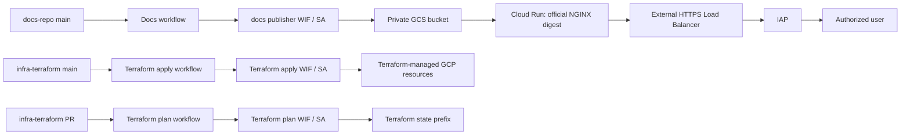

# システムアーキテクチャ

## 境界と最小権限

| 用途 | 信頼する GitHub Actions | 権限 |
| --- | --- | --- |
| docs 公開 | `docs-repo` の `main` / `deploy.yml` | 対象バケットのオブジェクト同期とバケット情報の読取り |
| Terraform PR plan | `infra-terraform` の PR / `terraform.yml` | 読取り専用ロールと state の `terraform/state/docs-hub/` prefix 限定アクセス |
| Terraform apply | `infra-terraform` の `main` / `terraform.yml` | GCS、Cloud Run、LB、IAP を更新するロール |

各 WIF Provider は GitHub の `repository_id`、`ref`、`workflow_ref` を検証します。サービスアカウントキー、共有 WIF Provider、プロジェクト IAM 管理権限は通常の CI/CD に与えません。

## 配信経路

1. `docs-repo` の `main` への push で MkDocs をビルドする。
2. docs 用 SA が成果物を非公開 GCS bucket へ同期する。
3. Cloud Run は bucket を読み取り専用で mount し、公式 NGINX の digest 固定イメージで配信する。
4. 外部アクセスは HTTPS Load Balancer と IAP を必ず通る。Cloud Run への直接公開はしない。
