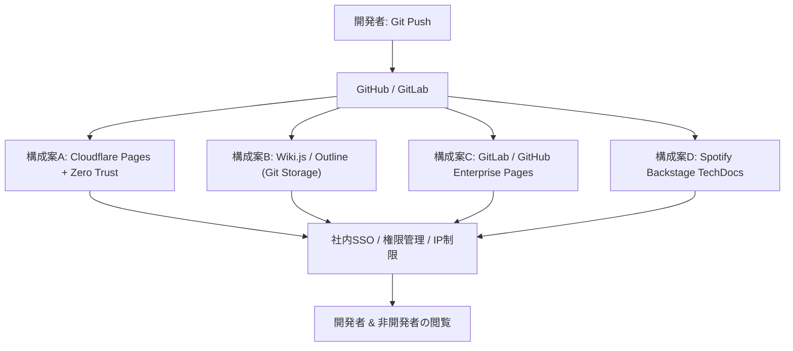

# モダンな社内ドキュメント共有手法・アーキテクチャ調査ガイド

**調査日時**: 2026年8月5日  
**目的**: 開発者の `git push` による即時反映（GitOps）、Markdown/HTML対応、社内SSO/ネットワーク制限、および柔軟な権限管理・閲覧制限を満たすモダンな社内ドキュメント共有プラットフォームの選定・比較。

---

## 1. 要件と課題の整理

社内ドキュメント共有において、以下のような要件を同時に満たす必要があります。

| 要件 | 詳細 |
| :--- | :--- |
| **フォーマット** | Markdown (`.md`) およびカスタム HTML (`.html`) を配置・レンダリングできること |
| **デプロイフロー** | 開発者が `git push` を行うと CI/CD や静的ホスティングにより即時反映されること (GitOps) |
| **閲覧者** | 開発者および非開発者（営業、人事、CSなど）が社内アカウント/SSOまたは社内NWで閲覧可能 |
| **権限管理・閲覧制限** | 社内SSO (Google Workspace, Entra ID, Okta等) と連携し、特定部署や役職のみ閲覧可能な権限制限 (RBAC/ABAC) |

---

## 2. 推奨アーキテクチャ構成案の比較

要件を満たす代表的な 4 つの構成案を以下にまとめます。



### アーキテクチャ比較表

| 項目 | 構成案A: SSG + Cloudflare Pages (Zero Trust) | 構成案B: Wiki.js (Git Storage) | 構成案C: GitLab Pages / GitHub Pages | 構成案D: Backstage TechDocs |
| :--- | :--- | :--- | :--- | :--- |
| **概要** | VitePress/Starlight + Edgeホスティング + Cloudflare Access | Git自動同期型 セルフホストWeb Wiki | クラウド/オンプレGitプラットフォーム付属Pages | 開発者ポータル統合型ドキュメント基盤 |
| **Markdown/HTML対応** | ○ (SSGで自由に構築可能) | ○ (Markdown, HTML, WYSIWYG対応) | ○ (Hugo/Docusaurus等でビルド) | ○ (MkDocs連携) |
| **Git push反映** | ◎ (GitHub/GitLab連携で即時ビルド) | ◎ (Git Push連動双方向同期) | ◎ (GitLab CI/GitHub Actionsで自動デプロイ) | ◎ (CI/CDでS3/GCS等へPush) |
| **非開発者の使いやすさ** | ◯ (閲覧に特化。CMS編集追加も可能) | ◎ (Web GUI編集 ＆ Git編集の両立) | ◯ (閲覧メイン) | ◯ (閲覧メイン) |
| **権限管理・閲覧制限** | ◎ (Cloudflare Accessでパス・グループ別制御) | ◎ (Wiki.js内でグラニュラーなRBAC設定) | ◯ (リポジトリ単位の権限、GitLab Enterpriseなら詳細可能) | ◯ (Backstageの権限プラグイン/SSO連携) |
| **運用コスト / インフラ** | サーバーレス (基本無料〜超安価) | Docker/Kubernetesサーバー運用 | 既存Git基盤の機能をそのまま利用 | Kubernetes/Node.js基盤の運用が必要 |

---

## 3. 各構成案の詳細解説

### 構成案A: SSG (VitePress/Starlight) + Cloudflare Pages & Access 【最も推奨】

最もモダンで高パフォーマンス、かつ保守コストが低い構成です。

- **静的サイト生成器 (SSG)**:
  - **VitePress**: Vueベースで超高速。デザインが洗練されており、検索機能 (Pagefind/Algolia) も容易に統合可能。
  - **Starlight (Astro)**: 多言語対応やサイドバー自動生成、HTML埋め込みが得意。
  - **MkDocs (Material for MkDocs)**: Pythonエコシステムで定評あり。
- **ホスティング & アクセス制御**:
  - **Cloudflare Pages**: GitHub/GitLabと連携し、`main` ブランチへの `git push` で自動ビルド。
  - **Cloudflare Access (Zero Trust)**: ページの前面にSSO認証壁を設置。Google Workspace、Entra ID (Azure AD)、Okta等とワンクリック連携。
  - **閲覧制限**: `/hr/*` は人事グループのみ、`/dev/*` は全社アクセス可など、パスごとに閲覧制限ルールを管理画面からノーコードで設定可能。

#### メリット
- インフラ管理が不要（サーバーレス）。
- レスポンスが世界最速レベル（Edge CDN配信）。
- パスごとの細かな権限・グループ制御がクラウド側で完結。

---

### 構成案B: Wiki.js（Git Storage連携）

非開発者が「Web画面からも直接編集したい」という要望がある場合に最適なオープンソースWikiです。

- **特徴**:
  - Node.js & PostgreSQL ベースで動作。
  - **Git Storage ディレクティブ**: Web画面での変更も Git にコミットされ、Git 上で `.md` ファイルを push した場合も Wiki.js 側に即座に同期される。
  - **強力な認証・権限管理**: SAML 2.0, OAuth2, OpenID Connect (OIDC), LDAP / Active Directory に標準対応。
  - ページ/フォルダごとの閲覧・編集権限（RBAC）を GUI から柔軟に設定可能。

#### メリット
- 非開発者はブラウザからWYSIWYG/Markdown編集、開発者は Git/VS Code から編集という併用が可能。
- 閲覧制限・権限管理機能がオールインワンで組み込まれている。

---

### 構成案C: GitLab Pages (Access Control) / GitHub Enterprise

自社で既に GitHub Enterprise や GitLab (SaaS / Self-hosted) を導入している場合に最短で構築できる方法です。

- **GitLab Pages Access Control**:
  - GitLab のリポジトリ権限（Guest, Reporter, Developer等）と連動し、GitLab ログインを要求してドキュメントを保護。
- **GitHub Pages (Private Pages)**:
  - GitHub Enterprise Cloud / Server でプライベートPagesを有効化し、GitHub 組織メンバーのみに閲覧制限。

#### メリット
- 既存の Git 基盤のユーザー・権限設定をそのまま流用できる。
- CI/CD パイプライン（GitLab CI / GitHub Actions）で静的サイトを自由なビルドツール（Docusaurus, MkDocs等）で生成可能。

---

### 構成案D: Spotify Backstage TechDocs

全社のマイクロサービス管理や社内開発者ポータル (Internal Developer Portal) を構築している企業に最適です。

- **特徴**:
  - 各サービスリポジトリ内に `/docs` ファイル（Markdown + `mkdocs.yml`）を配置。
  - CI/CD でビルドされたドキュメントが Central Backstage Portal に集約される。
  - 社内エンジニアリング組織全体のドキュメント検索・参照が一元化できる。

---

## 4. 閲覧制限・権限管理の実現パターン

ドキュメントの閲覧制限を実現するための主な技術パターンです。

### 1. IDP / SSO (OIDC/SAML) 連携
社内統合アカウント（Google Workspace, Microsoft Entra ID, Okta 等）を用いて認証します。
- ユーザー属性（部署・グループ）をトークン (JWT) 内で受け取り、ドキュメントのルーティング層でアクセス制限を実施。

### 2. Edge 認証ミドルウェア (Cloudflare Access / Vercel Authentication / AWS CloudFront + Lambda@Edge)
静的ファイルサーバーの前に認証レイヤーを挟む方法です。静的ファイル自体にログイン機能がなくても、ネットワークエッジでリクエストを検証・リダイレクトします。

### 3. アプリケーション内 RBAC (Wiki.js, GitBook Enterprise 等)
アプリケーション側がデータベースとセッション管理を持ち、ログインユーザーのロールに応じて表示コンポーネントやページ権限を制御します。

---

## 5. 推奨構成 (構成案A) の構築ステップ例

**VitePress + Cloudflare Pages + Cloudflare Access (SSO)** を導入する手順の概略です。

```
[ Local Repository ] --( git push )--> [ GitHub Private Repo ]
                                              │
                                   ( Automatic Build )
                                              │
                                              ▼
                                   [ Cloudflare Pages ]
                                              │
                                   ( Zero Trust SSO Gate )
                                              │
                                              ▼
                                     [ 社内ユーザー閲覧 ]
```

### Step 1: VitePress プロジェクトの準備
```bash
# ドキュメントリポジトリの初期化
npx create-vitepress-site
```
`docs/index.md` や各カテゴリの `.md` ファイルを作成し、リポジトリにコミットします。

### Step 2: Cloudflare Pages に連携
1. Cloudflare Dashboard から **Workers & Pages** -> **Create Application** -> **Pages** を選択。
2. 対象の GitHub / GitLab リポジトリを選択。
3. ビルド設定:
   - **Framework preset**: `VitePress`
   - **Build command**: `npm run docs:build`
   - **Build output directory**: `docs/.vitepress/dist`
4. デプロイを実行。以降、`git push` で数秒〜数分で自動反映されます。

### Step 3: Cloudflare Access による SSO & 閲覧制限の設定
1. Cloudflare Dashboard から **Zero Trust** を開く。
2. **Settings** -> **Authentication** で Identity Provider (Google Workspace / Entra ID 等) を統合。
3. **Access** -> **Applications** で `Add an Application` (Self-hosted) を選択。
4. ドメインに Cloudflare Pages の URL（例: `docs.your-company.com`）を指定。
5. Policy（ポリシー）を作成:
   - **Rule 1 (全社閲覧)**: Action `Allow` / Include: `Emails ending in @your-company.com`
   - **Rule 2 (特定パスの閲覧制限)**: `/executives/*` に対し、Include: `Group: Executive-Team`

---

## 6. まとめ・選定ガイドライン

- **とにかく簡単で保守コストをゼロにしたい / モダンなドキュメントサイトにしたい場合**:
  👉 **構成案A: VitePress + Cloudflare Pages + Zero Trust Access**
- **開発者以外の非開発者も Web 画面から気軽に編集・投稿させたい場合**:
  👉 **構成案B: Wiki.js (Git Storage モード)**
- **すでに GitHub Enterprise / GitLab を全社で使い込んでいる場合**:
  👉 **構成案C: GitLab Pages / GitHub Private Pages**
- **サービス仕様書や API ドキュメントを全社開発者ポータルに集約したい場合**:
  👉 **構成案D: Spotify Backstage TechDocs**

---

## 7. Web検索調査に基づく最新トレンドとセキュリティ運用ベストプラクティス

Web検索調査で判明した最新の導入傾向およびセキュリティ運用のポイントです。

### ① Cloudflare Access × VitePress の実用性と強み
* **VPN不要なリモートアクセス**: クラウド側（エッジ）で SSO 認証（Google Workspace / Entra ID）を行うため、社内 VPN に接続していなくてもセキュアに閲覧可能です。
* **低コスト運用**: Cloudflare Zero Trust は 50 ユーザーまで無料利用可能なプランがあり、小〜中規模組織であれば完全無料でゼロトラスト環境が手に入ります。
* **デバイスポスチャ連携**: 高いセキュリティ要件がある場合、MDM（Jamf や Intune）と連携して「会社の管理端末からのアクセスのみを許可する」設定も容易に追加できます。

### ② SaaS / OSS ドキュメント基盤における権限制限・同期の最新動向
* **GitBook (GitSync + Adaptive Content)**:
  * エンジニアは `git push`、非エンジニアは GitBook の WYSIWYG エディタから編集できる双方向同期機能が充実しています。
  * 「適応型コンテンツ (Adaptive Content)」機能により、ユーザーのロールや所属グループに応じてページ単位だけでなく**ページ内の特定のブロックレベルで表示/非表示を切替**可能です。
* **Wiki.js (Git Storage 連携)**:
  * フォルダ構造に基づいた強力な RBAC（ロールベースアクセス制御）を持ち、特定グループのみにフォルダ閲覧権限を付与できます。
  * SAML 2.0 / OpenID Connect による SSO 連携で退職者や異動者の権限をリアルタイムで同期できます。

### ③ 権限設計・アクセス制限における運用ベストプラクティス
1. **パス・リポジトリ分割によるグループ制御**:
   - ページ単位で細かくアクセス制限を設けると管理が煩雑になるため、リポジトリを分けるか、URL パス（例: `/public/*`, `/dev/*`, `/executives/*`）ごとに権限グループを紐付ける構成を推奨します。
2. **SCIM / IDP 一元管理**:
   - ドキュメント側のユーザーデータベースで個別に権限管理を行うのではなく、必ず社内 IDP (Microsoft Entra ID, Google Workspace, Okta) のグループ情報と同期（SAML/OIDC）させることで、情報漏洩リスクを低減します。

---

## 8. 各アプリリポジトリのドキュメント集約（セントラライズ）アプローチの検討

各アプリリポジトリにあるドキュメントを集約（セントラライズ）して一元管理・共有する手法についての評価・メリット・デメリットです。

### 結論
結論としては **「大いに『有り』であり、社内ナレッジの共有・検索性を高める上で非常に強力なアプローチ」** です。

ただし、**「ソースコードの書き場所（リポジトリ）まで 1 つに固めるのか」**、あるいは **「執筆は各アプリリポジトリで行い、デプロイ時に CI/CD で 1 つのポータルに自動集約するのか」** によって運用難易度とメリット・デメリットが大きく異なります。

---

### 実現のための 3 つの集約パターン

| パターン | 執筆場所 | 表示・ホスティング | 評価・推奨度 |
| :--- | :--- | :--- | :--- |
| **パターン1: ソース完全集約** | ドキュメント専用リポジトリ (`company-docs`) のみ | 集約サイト | 🔺 △（コードとドキュメントが離れて乖離しやすい） |
| **パターン2: 分散執筆 × CI/CD自動集約** | 各アプリリポジトリ (`/docs`) | 集約ポータル (Cloudflare Pages等) | 🟢 **◎（現代のベストプラクティス）** |
| **パターン3: Git Submodule / Monorepo** | アプリリポジトリ or モノレポ | 集約サイト | 🟡 ◯（設定管理の知識が必要） |

---

### メリット (Pros)

1. **全社的な横断検索・発見性 (Discoverability) の向上**
   - ドキュメントが 1 つの Web サイト（ポータル）に集約されるため、検索バー（Pagefind や Algolia 等）で「全社・全サービスの仕様書や手順書」を横断検索できます。「あの仕様書はどのリポジトリにあるか分からない」という問題を根本解決できます。
2. **統一された UX / UI とナビゲーション**
   - VitePress や Starlight、Docusaurus 等で 1 つの統一されたテーマ、共通サイドバー、パンくずリストが提供され、閲覧者（特に非開発者）にとって非常に見やすくなります。
3. **閲覧権限・アクセス制御の一元化**
   - 各アプリリポジトリの権限設定に依存せず、ポータル側の認証（Cloudflare Access や IDP SSO）1 箇所で全社・部署ごとのアクセス制御を集中管理できます。
4. **非開発者へのアクセシビリティ向上**
   - 営業・CS・企画などの非開発者は、GitHub/GitLab のコードリポジトリを巡る必要がなく、ポータルサイトの URL だけを知っていれば全情報にアクセスできます。

---

### デメリット (Cons) と対策

1. **コードとドキュメントの乖離 (Drift / Stale Docs)**
   - **問題**: パターン1（ソース完全集約）の場合、開発者がアプリのコードを変更した際、別リポジトリのドキュメントの更新を忘れやすくなります。
   - **対策**: パターン2（分散執筆 × 自動集約）を採用し、コードと同じ PR 内で `/docs` を更新させる運用を徹底する。
2. **所有権 (Ownership) とレビュー体制の乱れ**
   - **問題**: 誰がどのドキュメントに責任を持つのか、レビュー依頼先が曖昧になりがちです。
   - **対策**: GitHub の `CODEOWNERS` ファイルを活用し、`/docs/service-a/` 配下の変更通知先を対象アプリチームに設定する。
3. **CI/CD パイプライン・デプロイ構成の複雑化**
   - **問題**: 各アプリリポジトリで `git push` が発生した際、集約リポジトリやビルド環境へ通知・同期する CI/CD ワークフローの設定が必要です。
   - **対策**: GitHub Actions の `repository_dispatch` イベントや、マルチリポジトリからビルド時に `.md` をフェッチするビルドスクリプトをテンプレート化する。

---

### 失敗しないための推奨構成（パターン2 の具体例）

開発体験（DX）と全社ポータルとしての検索性を両立する最適な構成は以下の通りです。

```
[ App-A Repo ]  --( docs/ 内の変更を git push )--┐
                                                │ (GitHub Actions / dispatch)
[ App-B Repo ]  --( docs/ 内の変更を git push )--┼──> [ Docs Portal Repo (VitePress) ]
                                                │            │
[ App-C Repo ]  --( docs/ 内の変更を git push )--┘     ( Auto Build & Deploy )
                                                             │
                                                             ▼
                                                [ Cloudflare Pages + SSO ]
```

1. **執筆**: 開発者は各アプリリポジトリの `/docs` ディレクトリ内で Markdown を作成・PR レビュー。
2. **同期・ビルド**: 各アプリリポジトリで `main` ブランチにマージされた際、GitHub Actions が集約用リポジトリにドキュメント差分を送信（または集約リポジトリ側がビルド時に各リポジトリの `/docs` をクローン/ダウンロード）。
3. **配信**: VitePress 等が集約リポジトリの全ファイルを 1 つの静的サイトとしてビルドし、Cloudflare Pages 等で全社公開。

---

## 9. ドキュメントジェネレーター (VitePress vs MkDocs vs Starlight vs Docusaurus vs Hugo) の選定・比較

社内ドキュメントサイトを構築する際の主要 SSG (Static Site Generator) の比較と選定基準です。

### ツール別比較一覧表

| ツール名 | 基盤技術 | ビルド速度 | UI/デザイン初期クオリティ | カスタムコンポーネント | 多言語 (i18n) | バージョン管理 (Versioning) | おすすめの組織 |
| :--- | :--- | :--- | :--- | :--- | :--- | :--- | :--- |
| **VitePress** | Vue 3 / Vite | 🔥 爆速 | 👑 極めて美しい (標準で洗練) | Vue 3 | ◯ 標準対応 | ◯ (ブランチ/パス管理) | **一般企業・Webエンジニア全般（最も推奨）** |
| **Material for MkDocs** | Python / Jinja2 | ◯ 高速 | ◎ 実用的・機能的 | Jinja2 / HTML | ◯ プラグイン | △ | **Python / SRE / インフラエンジニア** |
| **Starlight (Astro)** | Astro | ⚡️ 超高速 | ◎ モダン・洗練 | React/Vue/Svelte等 | 👑 最強 (標準サポート) | ◯ | **多言語ドキュメント・マルチUI基盤** |
| **Docusaurus** | React / MDX | ◯ 普通 | ◎ クラシック | React (MDX) | ◯ 標準対応 | 👑 最強 (標準機能) | **React開発組織・複数バージョン保持製品** |
| **Hugo** | Go | 🚀 宇宙最速 | △ テーマに依存 | HTML / Shortcodes | ◯ 対応 | △ | **数万ページ規模の超大規模ドキュメント** |

---

### 各ツールの特徴と詳細解説

#### 1. VitePress 【⭐ 全般に最もおすすめ】
Vue.js や Vite の公式ドキュメントで採用されている静的サイトジェネレーターです。
- **強み**:
  - 設定ファイル (`config.mts`) が非常にシンプルで、数分でサイトが立ち上がる。
  - デフォルトのテーマが現代的で美しく、ダークモードや見出し目次 (TOC)、検索 (Pagefind/Algolia) が標準搭載。
  - Markdown ファイル内で直接 Vue 3 コンポーネントを呼び出せる。
- **弱み**:
  - 複数バージョンの切り替え（v1, v2など）を構築する場合はフォルダ分割等の工夫が必要。

#### 2. Material for MkDocs (MkDocs) 【SRE・Pythonエンジニアに人気】
Python エコシステムで絶大な人気を誇るドキュメントジェネレーターです。
- **強み**:
  - プラグインが極めて豊富（Mermaid 構成図、コードの行強調・注釈、折りたたみブロック、検索など）。
  - Markdown の拡張記法（Admonition / Alert など）が非常に充実しており、技術文書が書きやすい。
  - Spotify Backstage TechDocs の標準レンダラーとしても採用されている。
- **弱み**:
  - Python 環境（Python, pip, Docker 等）が必要。
  - リッチなフロントエンドアニメーションやダイナミックな UI 拡張はしにくい。

#### 3. Starlight (Astro) 【多言語・フレームワーク非依存】
Astro フレームワーク上に構築された最新のドキュメントテーマです。
- **強み**:
  - **アイランドアーキテクチャ**: 必要な部分だけ JS を読み込むため閲覧速度が極めて速い。
  - **フロントエンドの柔軟性**: React, Vue, Svelte, Tailwind CSS など好みのライブラリをそのまま埋め込める。
  - **i18n (多言語化)** とサイトマップ・サイドバー自動生成が極めて優秀。
- **弱み**:
  - VitePress や Docusaurus と比べると歴史が浅いが、急速にシェアを伸ばしている。

#### 4. Docusaurus 【React / バージョニング必須な大規模向け】
Meta (Facebook) が開発している React ベースのドキュメント基盤です。
- **強み**:
  - **バージョン管理機能 (Docs Versioning)**: `v1.0`, `v2.0` など、過去の仕様書と最新仕様書をワンクリックで切り替える機能が標準搭載。
  - React (MDX) をフル活用できるため、インバウンドなコンポーネント開発が自由自在。
- **弱み**:
  - VitePress / Starlight に比べるとビルド速度がやや遅く、設定の学習コストが少し高い。

#### 5. Hugo 【超大規模サイト向け】
Go 言語で書かれた超爆速の静的サイト生成器です。
- **強み**: 数万ページあるドキュメントでも数秒でビルドが完了する。
- **弱み**: Go テンプレート言語の習得が必要で、ドキュメント用のテーマカスタマイズがやや難解。

---

### 最終的な選び方ガイド

1. **「特にこだわりがない / すぐに綺麗で爆速なサイトを作りたい」**
   👉 **VitePress** が第一選択肢（迷ったらこれ）。
2. **「インフラ・SRE チーム中心 / Python 環境に馴染みがある / Backstage を将来使う」**
   👉 **Material for MkDocs**
3. **「多言語展開したい / React や Vue など様々なパーツを埋め込みたい」**
   👉 **Starlight (Astro)**
4. **「API仕様書や製品マニュアルのバージョン (v1.0, v2.0...) 管理が必須」**
   👉 **Docusaurus**

---

## 10. 複数アプリ・複数ブランチでのドキュメント上書き防止策

各アプリリポジトリから GitHub Actions (`peaceiris/actions-gh-pages` など) を使って公開用リポジトリや共通サーバーにデプロイする際、**「単純に実行すると他のアプリや他のブランチのファイルがまるごと上書き消去される」** という問題が発生します。

この上書き衝突を防ぐための具体的かつシンプルな解決アプローチを 3 パターン紹介します。

---

### アプローチ比較

| 手法 | 仕組み | 上書き防止の仕組み | メリット | デメリット / 注意点 |
| :--- | :--- | :--- | :--- | :--- |
| **A. `keep_files: true` ＋ アプリ別サブフォルダ分割** | 各アプリの Actions から直接集約 Pages へ Push | `destination_dir` でフォルダ分けし、他ファイルを消さない設定を入れる | 各アプリの CI だけの設定で完結しシンプル | 大量の差分コミットが集約リポジトリに発生する |
| **B. 中央ポータルによる一括 Fetch＆ビルド (推奨)** | 各アプリはコードのみ。集約側 CI で各アプリの `/docs` をクローン | 集約ポータル側が一元管理し、ビルド時に各アプリを整列 | 事故がゼロ。全社横断検索・統一ナビが完璧 | 集約リポジトリ側に集約ビルド CI を書く必要がある |
| **C. Cloudflare Pages の自動プレビュー** | ブランチ/PR ごとにユニークな別 URL を自動発行 | メメイン環境 (`main`) とブランチ環境が完全分離される | PR レビューが格段にやりやすくなる | プレビュー用の URL 管理が必要 |

---

### アプローチ A: `keep_files: true` による差分追加デプロイ

GitHub Actions の Pages デプロイアクション等で、**①「アプリごとの出力先フォルダを分ける (`destination_dir`)」**、**②「既存の他フォルダを消さない (`keep_files: true`)」** の 2 点を設定します。

#### 各アプリ側の `.github/workflows/deploy-docs.yml`
```yaml
name: Deploy App Docs
on:
  push:
    branches: [ main ] # ブランチごとに上書きされないよう main のみ実行を推奨

jobs:
  deploy:
    runs-on: ubuntu-latest
    steps:
      - uses: actions/checkout@v4

      # ドキュメント専用集約リポジトリ (例: company/docs-site) の gh-pages ブランチへデプロイ
      - name: Deploy to Central Docs Repo
        uses: peaceiris/actions-gh-pages@v3
        with:
          deploy_key: ${{ secrets.DOCS_DEPLOY_KEY }} # 集約リポジトリへの書き込みキー
          external_repository: company/docs-site      # 集約ドキュメントリポジトリ
          publish_branch: gh-pages
          publish_dir: ./docs                         # 公開したいディレクトリ
          destination_dir: apps/app-a                 # ★アプリごとにフォルダを分ける
          keep_files: true                            # ★既存の他アプリのファイルを消さずに残す！
```
- **閲覧 URL**: `https://docs.company.com/apps/app-a/`

---

### アプローチ B: 中央ポータルによる一括 Fetch & ビルド（最推奨・事故ゼロ）

各アプリリポジトリではデプロイ処理を行わず、**「集約ポータルリポジトリ（VitePress等）側の CI」** で全アプリの `/docs` を引き込んで一括ビルドします。

```
[ App-A Repo ] ──( push )──> repository_dispatch ──┐
                                                    ▼
[ App-B Repo ] ──( push )──> repository_dispatch ──> [ Docs Portal Repo ]
                                                          │ (GitHub Actions)
                                                          ├ 1. App-A の /docs を取得
                                                          ├ 2. App-B の /docs を取得
                                                          └ 3. VitePress で一貫ビルド＆デプロイ
```

#### 集約ポータル側の GitHub Actions (`.github/workflows/build-all.yml`)
```yaml
name: Build & Deploy All Docs
on:
  push:
    branches: [ main ]
  repository_dispatch: # 各アプリリポジトリから通知を受けた時にも発火
    types: [ app-docs-updated ]
  schedule:
    - cron: '0 0 * * *' # 毎日夜間に自動同期

jobs:
  build:
    runs-on: ubuntu-latest
    steps:
      - uses: actions/checkout@v4 # 集約ポータル（VitePress）の取得

      # アプリ A のドキュメントをチェックアウトして配下に置く
      - uses: actions/checkout@v4
        with:
          repository: company/app-a
          path: docs/apps/app-a
          sparse-checkout: docs # docs フォルダのみをピンポイント取得

      # アプリ B のドキュメントをチェックアウトして配下に置く
      - uses: actions/checkout@v4
        with:
          repository: company/app-b
          path: docs/apps/app-b
          sparse-checkout: docs

      # 全体が揃った状態で VitePress を一括ビルド
      - name: Build VitePress
        run: |
          npm ci
          npm run docs:build

      # デプロイ (Cloudflare Pages や GitHub Pages)
      - name: Deploy
        uses: cloudflare/pages-action@v1
        with:
          apiToken: ${{ secrets.CLOUDFLARE_API_TOKEN }}
          accountId: ${{ secrets.CLOUDFLARE_ACCOUNT_ID }}
          projectName: company-docs
          directory: docs/.vitepress/dist
```

#### メリット
- アプリ側は普通に `/docs` に Markdown をコミットするだけ（シンプルな構成）。
- **上書き事故が 100% 発生しない。**
- 全アプリをまとめたサイトマップや横断検索インデックスが完璧に生成される。

---

### まとめ・おすすめの運用

* **シンプルに各アプリからデプロイしたい場合**:
  👉 **`destination_dir: apps/app-name`** と **`keep_files: true`** を指定する。
* **ブランチ（`feature/*`）の表示確認もしたい場合**:
  👉 **Cloudflare Pages / Vercel** などのプレビューデプロイ機能を使い、ブランチごとに使い捨ての試用 URL を発行する。
* **上書き事故を防ぎ、横断検索やデザインを統一したい場合**:
  👉 アプローチ B（**中央ポータルでの一括ビルド**）が最も安全で保守性が高くなります。


