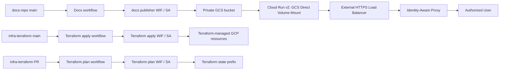

# GCP WIF / IAP / Cloud Run の最小権限 & アーキテクチャガイド

> 更新日: 2026-08-12

## 1. 概要と基本構成

本システムは、Google Cloud Platform (GCP) 上で非公開の社内ドキュメント基盤（MkDocs Material + 生 HTML レポート）を安全かつサーバーレスに配信するためのインフラ・配信パイプラインです。



---

## 2. 最小権限と WIF (Workload Identity Federation) 設計

GitHub Actions から GCP への認証には永続キー（SA キー JSON）を一切使用せず、短時間有効な OIDC トークンに基づく Workload Identity Federation を採用しています。用途に応じて Identity/SA を 3 つに完全分離し、最小権限原則（Least Privilege）を徹底しています。

| サービス | WIF Identity / SA | 信頼条件 (Claim Validation) | 付与権限・用途 |
| --- | --- | --- | --- |
| **Terraform Plan** | `github-terraform-plan` | `repository_id=1327451305`<br>`ref=refs/pull/*/merge`<br>`workflow_ref` 固定 | 読取り専用ロール + State バケットの `terraform/state/docs-hub/` Prefix 限定 objectUser |
| **Terraform Apply** | `github-terraform-deployer` | `repository_id=1327451305`<br>`ref=refs/heads/main`<br>`workflow_ref` 固定 | GCS、Cloud Run、LB、IAP のリソース管理ロール |
| **Docs Publisher** | `github-docs-publisher` | `repository_id=1327472883`<br>`ref=refs/heads/main`<br>`workflow_ref` 固定 | 対象ドキュメント GCS バケットの `roles/storage.objectAdmin` & `roles/storage.legacyBucketReader` |

> [!IMPORTANT]
> - すべての WIF Provider で `assertion.repository_id`、`assertion.ref`、`assertion.workflow_ref` を厳格に検証しています。
> - `projectIamAdmin` や `workloadIdentityPoolAdmin` などの広範な特権は CI サービスアカウントに付与しません。

---

## 3. ストレージ & セキュリティ設計

### GCS バケットセキュリティ
- **ドキュメント配信バケット**: Uniform bucket-level access を強制適用し、`public_access_prevention = "enforced"` にて公開を抑止。オブジェクトのバージョニングを有効化し 30 日前の古いバージョンを自動削除。
- **State バケット**: Uniform bucket-level access を有効化し、IAM Condition による Prefix スケーピング（`terraform/state/docs-hub/`）を可能にしています。

### Cloud Run & 配信コンテナ
- **Direct GCS Volume Mount**: Cloud Run v2 のボリューム機能で GCS バケットを `/usr/share/nginx/html` へ `read_only` マウント。ドキュメント更新時に Cloud Run の再デプロイが不要。
- **公式 NGINX Digest 固定**: コンテナイメージは可変タグ（`latest` 等）を使わず、`nginx@sha256:...` の immutable digest で固定。
- **ネットワーク境界**: Cloud Run の Ingress を `INGRESS_TRAFFIC_INTERNAL_LOAD_BALANCER` に限定。IAP システム SA のみに `roles/run.invoker` を付与し、外部からの直アクセスを完全遮断。

---

## 4. ドキュメント配信パイプライン & 生 HTML 対応

1. **MkDocs & 生 HTML 配信**:
   - `docs/` 配下の Markdown は MkDocs Material で HTML 化。
   - `docs/html/` 配下の生 HTML（独立した分析レポートやダッシュボード等）は Pass-through 配信。
2. **目次インデックス自動生成**:
   - `python scripts/generate_html_index.py` により `docs/html/` 配下の HTML から `<title>` や `<h1>` を抽出し、`mkdocs.yml` の左ナビゲーションツリーへ動的挿入。
3. **再現性 & 依存管理**:
   - Python 依存関係は `uv.lock` で完全固定し、CI/CD 内では `uv sync --frozen` を実行。

---

## 5. 動作検証結果と運用手順

### 開発・検証ステータス (2026-08-12 時点)
- **Terraform 構文・設定検証**: `infra-terraform`（ルートおよび `bootstrap/`）にて `terraform validate` 正常終了（Terraform `1.15.8` / Google Provider `7.43.0`）。
- **MkDocs 構築検証**: `docs-repo` にて `uv run mkdocs build --strict` 正常終了。

### GCP 管理者向け最短セットアップ手順
```bash
# 1. State バケットの Uniform Bucket-level Access 有効化
gcloud storage buckets update gs://<YOUR_STATE_BUCKET> \
  --uniform-bucket-level-access

# 2. Bootstrap スタックの適用 (WIF / SA 作成)
cd infra-terraform/bootstrap
terraform init
terraform apply

# 3. ルートスタックの適用 (インフラ作成)
cd ..
terraform init
terraform apply
```
