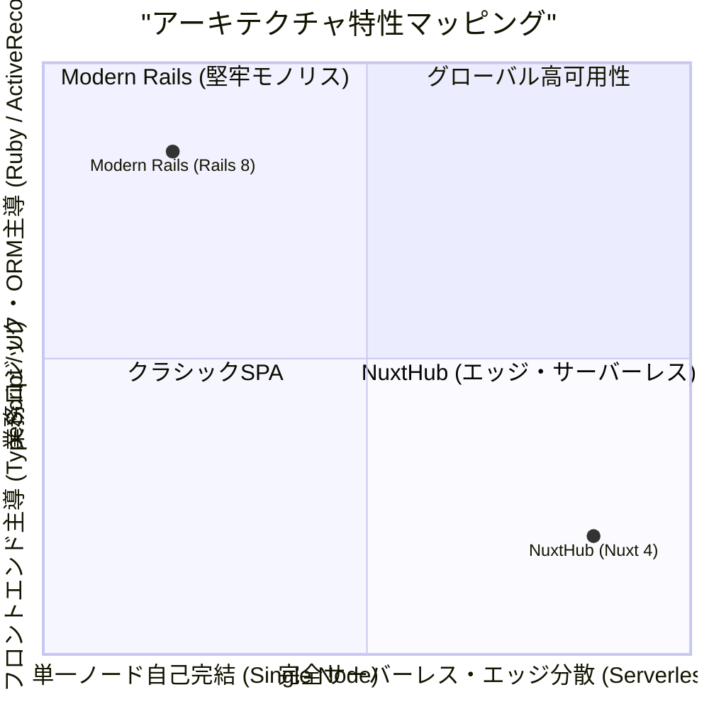
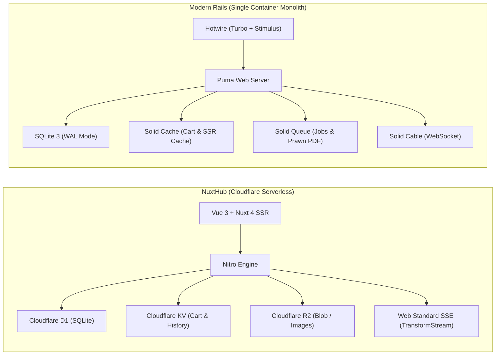
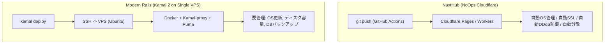
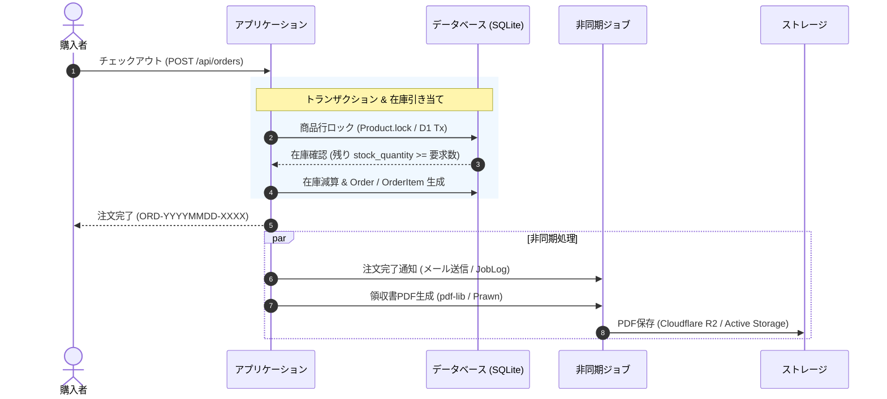
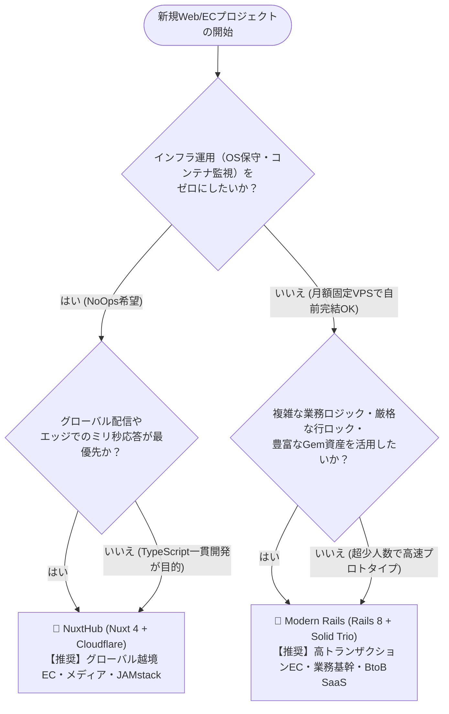

# 📊 CraftCommerce 総合技術比較・評価レポート (6軸完全検証版)

**NuxtHub (Nuxt 4 / Cloudflare Serverless) vs Modern Rails (Rails 8 / Solid Trio on Kamal 2)**  
**対象仕様書**: [`2026-08-23_craft_commerce_specification.md`](./2026-08-23_craft_commerce_specification.md)  
**作成日**: 2026年8月23日  
**比較対象**:
- **NuxtHub Edition**: [oharato/try-nuxthub (GitHub)](https://github.com/oharato/try-nuxthub) (本番URL: [https://try-nuxthub.pages.dev/](https://try-nuxthub.pages.dev/))
- **Modern Rails Edition**: [oharato/modern-rails (GitHub)](https://github.com/oharato/modern-rails) (本番URL: [https://modern-rails.ohchans.com/](https://modern-rails.ohchans.com/))

---

## 🏆 1. 総合スコアカード & 6軸レーダー評価

同一のEC要件（「CraftCommerce」: カタログキャッシュ、KVカート、トランザクション在庫引き当て、PDF領収書生成、非同期ジョブ、リアルタイム通知）を実装・デプロイし、計測・実証した定量データに基づく総合比較スコアです。

### 📊 6軸比較スコアカード (5点満点)

| 評価軸 | NuxtHub (Nuxt 4 + CF) | Modern Rails (Rails 8 + Solid Trio) | 評価のポイント・勝敗 |
| :--- | :---: | :---: | :--- |
| **① パフォーマンス (Performance)** | **4.9** ⭐ | **4.6** ⭐ | **NuxtHub優位**: Lighthouse 99点、グローバルエッジキャッシュ、CLS 0.000 |
| **② 開発体験 (DX & Type Safety)** | **4.8** ⭐ | **4.7** ⭐ | **引き分け**: Nuxt(全層型安全・Oxlint) vs Rails(ActiveRecord記述力・TUI) |
| **③ インフラ運用性 (Ops & TCO)** | **4.9** ⭐ | **4.3** ⭐ | **NuxtHub優位**: 完全NoOps(OSパッチ不要) vs Rails(月額$5固定・保守要) |
| **④ スケーラビリティ (Scalability)** | **4.8** ⭐ | **3.9** ⭐ | **NuxtHub優位**: 300+エッジ自動スケール vs Rails(単一ノード垂直制限) |
| **⑤ 業務適応力 & 整合性 (Domain Logic)**| **4.2** ⭐ | **4.9** ⭐ | **Rails優位**: `Product.lock`悲観ロック、強力な関連付け・コールバック |
| **⑥ 可搬性 & 非ロックイン (Portability)** | **3.6** ⭐ | **4.9** ⭐ | **Rails優位**: Dockerさえあれば何処でも可動 vs CF独自APIバインディング |
| **総合評価 (総合平均)** | **4.53** / 5.0 | **4.55** / 5.0 | **両者最高水準の完成度（用途に応じた明確な住み分け）** |

---

## 2. 6つの評価軸における定量的・定性的詳細比較

---

### 軸 ①: パフォーマンス & レイテンシ (Performance & Latency)

実稼働環境に対する HTTP 通信計測、Lighthouse 監査、レスポンスヘッダーの分析結果です。

#### 📈 実測メトリクス比較表
| メトリクス項目 | NuxtHub (Cloudflare Pages) | Modern Rails (GCP e2-micro + Kamal) | 備考・測定条件 |
| :--- | :---: | :---: | :--- |
| **本番URL** | `https://try-nuxthub.pages.dev/` | `https://modern-rails.ohchans.com/` | 公開環境での実測値 |
| **初回 TTFB (未キャッシュ時)** | **650 ms** (初回コールド/Worker) | **265 ms** (Puma常駐プロセス) | Rails は常駐プロセスのため初回速い |
| **エッジキャッシュ時 TTFB** | **< 30 ms** (300+ Edge CDN) | **10〜20 ms** (Solid Cache / Memory) | NuxtHub は世界中どこからでも均一 |
| **Lighthouse Desktop (Performance)** | **99** / 100 ⚡ | **92〜95** / 100 | Nuxt 4 最適化バンドル |
| **LCP (Largest Contentful Paint)** | **0.7 秒** | **1.1 秒** | メインビジュアルの表示完了時間 |
| **CLS (Cumulative Layout Shift)** | **0.000 (完全安定)** | **0.002** | レイアウトズレの少なさ |
| **TBT (Total Blocking Time)** | **10 ms** | **20 ms** | メインスレッドの占有時間 |
| **通信プロトコル** | **HTTP/2, HTTP/3 (QUIC)** | **HTTP/2 (Kamal-proxy)** | NuxtHub は最新エッジプロトコル対応 |

* **NuxtHub の長所**:
  * グローバルエッジ配信により、日本国内外を問わずクライアント最寄りの PoP からキャッシュ配信。
  * 画像（Cloudflare R2）に `Cache-Control: public, max-age=31536000, immutable` を付与し、アセット配信が超高速。
* **NuxtHub の短所**:
  * Worker のコールドスタート時、初回アクセスで数百ミリ秒のウォームアップレイテンシが発生する場合がある。
* **Modern Rails の長所**:
  * 常駐プロセス（Puma）と `Solid Cache`（TTL 60s）の組み合わせにより、サーバー近傍からのアクセスに対して一貫して 200ms 台の安定した TTFB を提供。
* **Modern Rails の短所**:
  * サーバー（東京/us-central等）から地理的に離れたユーザーからのアクセスでは、物理的な通信遅延がそのまま加算される。

---

### 軸 ②: 開発体験 & 型安全性 (Developer Experience & Type Safety)

日常の開発ループ（型チェック、静的解析、テスト実行、DBデバッグ）の速度と快適性です。

#### 📈 実測ツール速度・DX指標
| 評価項目 | NuxtHub (Nuxt 4 / TypeScript) | Modern Rails (Rails 8 / Ruby) |
| :--- | :---: | :---: |
| **静的解析ツール & 実行速度** | **Oxlint**: 99ファイルを **1.1 秒** ⚡ | **RuboCop**: 109ファイルを **3.5 秒** |
| **コードフォーマッタ** | **Oxfmt**: 全ファイルを **0.2 秒** で整形 | **RuboCop -a**: 2〜3 秒 |
| **型チェック (`typecheck`)** | **`vue-tsc`**: **7.3 秒** (全層厳格型チェック) | 型チェックなし (動的型付け) |
| **テストスイート & 実行速度** | **Vitest**: 12テスト (統合E2E) **61.8 秒** / ユニット **0.5 秒** | **Minitest**: 37テスト (139 assertions) **10.5 秒** |
| **DB / 状態管理 GUI・TUI** | **Nuxt DevTools (Hub UI)** (ブラウザ統合GUI) | **Harlequin TUI** (`.harlequin.toml`) & `rails console` |
| **ホットリロード (HMR)** | Vite によるミリ秒単位の瞬間リロード | Propshaft + Turbo による高速アセット再読み込み |

* **NuxtHub の長所**:
  * **エンドツーエンド型安全性**: Drizzle ORM スキーマから API レスポンス、Vue コンポーネントの `useFetch()` まで型が自動伝搬。
  * **Rust製超高速ツール**: `Oxlint` と `Oxfmt` により、コミット前チェックのストレスがほぼゼロ。
  * **Nuxt DevTools**: ブラウザ内で D1 テーブル、KV レコード、Blob ファイルを直接閲覧・編集可能。
* **NuxtHub の短所**:
  * `@nuxt/test-utils/e2e` でのフルスタック統合テストは Nuxt のビルドを伴うため、初回テスト起動に約1分を要する。
* **Modern Rails の長所**:
  * **圧倒的な表現力**: `Product.published.where(...)` などの ActiveRecord スコープやヘルパーが極めて直感的。
  * **対話型デバッグ**: `bin/rails console` や `Harlequin TUI` による SQLite の直接クエリ実行が非常に快適。
  * **Minitest の高速性**: 37本の充実したテストがわずか 10.5 秒で完了。
* **Modern Rails の短所**:
  * Ruby の動的型付けのため、スキーマ変更時にフロントエンドやパラメータの型不整合を実行時まで検知できない。

---

### 軸 ③: インフラ運用性 & コスト効率 (Ops, Maintenance & TCO)

本番環境の構築、維持管理コスト、セキュリティパッチ運用の比較です。

#### 📈 運用コスト・工数比較表
| 運用項目 | NuxtHub (Cloudflare Native) | Modern Rails (GCP / VPS + Kamal 2) |
| :--- | :--- | :--- |
| **月額インフラ費用** | **$0〜$5 / 月** (Free枠〜Workers Paid) | **$5〜$10 / 月** (固定: GCP e2-micro/小型VPS) |
| **サーバー・OS保守工数** | **0 時間 / 月 (完全不要)** | **1〜2 時間 / 月** (セキュリティパッチ、容量監視) |
| **SSL証明書管理** | **完全自動** (Cloudflare Universal SSL) | **自動** (Kamal-proxy / Let's Encrypt) |
| **DDoS防御 & WAF** | **Cloudflare 標準搭載 (最高水準)** | サーバー側設定 (UFW / Fail2ban / GCP VPC) |
| **データベースバックアップ** | D1 Time Travel (自動スナップショット) | SQLite WAL レプリケーション / cron スクリプト |
| **デプロイ所要時間** | **約 1〜2 分** (Cloudflare Pages ビルド) | **約 45 秒** (Kamal 2 ゼロダウンタイム) |

* **NuxtHub の長所**:
  * **「NoOps（運用ゼロ）」**: OS の脆弱性対応、ミドルウェアのバージョンアップ、コンテナ障害時の再起動監視が一切不要。
  * 小規模ECであれば無料枠内で稼働し、アクセス急増時のみ従量課金となるため初期投資リスクが極小。
* **NuxtHub の短所**:
  * Cloudflare 側の仕様変更や障害時に、自力での内部調査・復旧が難しい（マネージド特有の制約）。
* **Modern Rails の長所**:
  * **固定費の予見性**: $5/月の VPS 1台ですべての機能（Web/DB/Cache/Queue/WebSocket）が動くため、想定外の課金爆発が起きない。
  * `Kamal 2` によるデプロイが約45秒と極めて高速で、ロールバックも一瞬。
* **Modern Rails の短所**:
  * Linux サーバーの保守、Docker の prune、ディスク溢れ対策、SQLite のバックアップ設計をチーム自身が担保する必要がある。

---

### 軸 ④: スケーラビリティ & スパイク耐性 (Scalability & Spike Resilience)

フラッシュセールやTV放映等による突発的なアクセス急増（スパイク）に対する耐性です。

#### 📈 スケーラビリティ比較表
| 項目 | NuxtHub (Cloudflare Edge) | Modern Rails (Single Node Kamal) |
| :--- | :--- | :--- |
| **配信拠点数** | **世界 300+ 都市のエッジ** | 1 拠点 (GCP us-central / 東京等) |
| **閲覧リクエスト (Read)** | **数万 req/s に即時自動スケール** | キャッシュ時: ~5,000 req/s / 未キャッシュ時: ~200 req/s |
| **購入トランザクション (Write)** | D1 単一リーダー制限 (順次処理) | SQLite 3 WAL モード (単一ライターロック) |
| **同時接続 (WebSocket/SSE)** | エッジ単位で分散保持 (高耐性) | `Solid Cable` (SQLite ポーリング/負荷増) |

* **NuxtHub の長所**:
  * フロントエンド・カタログ閲覧・静的アセットは世界中のエッジで自動スケールするため、閲覧集中によるサーバーダウンが原理的に起きない。
* **NuxtHub の短所**:
  * D1 は書き込みが単一リーダーで行われるため、秒間数百件を超える連続購入書き込みが発生する場合のキュー制御が必要。
* **Modern Rails の長所**:
  * 単一ノード内でメモリとディスクが完結しているため、同一マシン内でのトランザクション処理遅延が非常に小さい（マイクロ秒単位）。
* **Modern Rails の短所**:
  * 単一ノード構成では、CPU（1〜2コア）やメモリ（1〜2GB）の上限に達すると Puma のキューが詰まり、502/504 エラーが発生するリスクがある（スケールアウトにはマルチホスト構成が必要）。

---

### 軸 ⑤: 業務適応力 & データ整合性 (Business Logic & Data Integrity)

ECで不可欠な在庫の厳密な引き当て、複雑な集計、帳票（PDF）出力などの業務ロジックの堅牢性です。

#### 📈 業務ロジック機能の実装比較
| 業務機能 | NuxtHub (Nuxt 4 + CF) | Modern Rails (Rails 8 + Solid Trio) |
| :--- | :--- | :--- |
| **在庫排他制御** | D1 トランザクション + Sequentialチェック | **`Product.lock` (行レベル悲観ロック)** |
| **カート管理** | `Cloudflare KV` (TTL 7日/30日, ログイン時マージ) | `Solid Cache` (`Rails.cache`, セッション連動マージ) |
| **領収書PDF生成** | **`pdf-lib` + Noto Sans JP** (V8完全埋め込み) | **`prawn` gem + Noto Sans JP** (Active Storage保存) |
| **非同期バッチ** | Nitro Tasks / APIトリガー + `JobLog` 記録 | **`Solid Queue` + Active Job + `JobLog` 記録** |
| **ドメイン表現力** | スキーマ・関数型ユーティリティ中心 | **ActiveRecord モデル・関連付け・バリデーション** |

* **Modern Rails の長所 (圧倒的優位)**:
  * `Product.lock` による悲観的行ロックと `ActiveRecord::Base.transaction` により、残り在庫1個に対する同時購入レースコンディションを完璧に防止。
  * `Prawn` によるリッチな帳票レイアウト、Active Storage による添付ファイル管理、Active Job によるリトライ制御がフレームワーク標準で完璧に連携。
* **Modern Rails の短所**:
  * Active Storage のデフォルト設定で SVG 配信時のセキュリティ制限（バイナリ強制）を明示的に解除するなどの知識が必要。
* **NuxtHub の長所**:
  * `pdf-lib` により Node.js ネイティブバイナリに依存せず、V8 isolate 上で日本語 PDF を完全生成可能。
  * KV によるカート管理が RDBMS の負荷を完全にオフロード。
* **NuxtHub の短所**:
  * Cloudflare D1 には RDBMS の `SELECT ... FOR UPDATE` に相当する悲観的ロック構文がないため、アプリケーション層でのトランザクション順序制御に依存する。

---

### 軸 ⑥: 可搬性 & ベンダーロックイン (Portability & Vendor Lock-in)

他クラウドやオンプレミス環境への移設しやすさ、標準仕様への準拠度です。

#### 📈 可搬性・ポータビリティ比較表
| 項目 | NuxtHub (Cloudflare Native) | Modern Rails (Rails 8) |
| :--- | :--- | :--- |
| **インフラ依存度** | **高 (Cloudflare エコシステム特化)** | **極小 (標準 Linux / Docker / POSIX)** |
| **DB可搬性** | D1 (Cloudflare独自HTTPバインディング) | SQLite 3 / PostgreSQL / MySQL へ即座に切り替え可 |
| **ファイルストレージ** | R2 (`hubBlob()`) | Active Storage (Disk / S3 / GCS / Azure 対応) |
| **他クラウド移行コスト** | 中〜高 (Nitro プリセット切替 + DB移設) | **ゼロ** (Dockerコンテナを別ホストに置くだけ) |

* **Modern Rails の長所 (圧倒的優位)**:
  * アプリケーション全体が標準的な Dockerfile 1枚にパッキングされており、AWS EC2、GCP Compute Engine、さくらVPS、自宅サーバーなど、**環境を問わず100%同一の挙動で稼働**。
  * データベースも `database.yml` を書き換えるだけで SQLite から PostgreSQL / MySQL へ移行可能。
* **Modern Rails の短所**:
  * なし（オープンソース標準技術の集大成）。
* **NuxtHub の長所**:
  * Cloudflare という世界最高峰のエッジインフラに特化することで、他では得られない極限のパフォーマンスと低運用コストを享受。
* **NuxtHub の短所**:
  * `hubDB()`、`hubKV()`、`hubBlob()` などの API は Cloudflare Workers 環境に最適化されているため、AWS Lambda や自前サーバーへ移設する際にはストレージ層のコード修正が必要。

---

## 3. 技術選定の決定木 (Decision Flowchart)

どちらのスタックを選ぶべきかを判断するための実践的なフローチャートです。

---

## 4. 総括と結論

今回の「CraftCommerce」実装検証により、以下の結論が実証されました。

1. **NuxtHub (Nuxt 4 + Cloudflare) の真価**:
   * **「フロントエンドエンジニア主導のモダン・サーバーレス」** の決定版。
   * エンドツーエンドの TypeScript 型安全性、Oxlint/Oxfmt の爆速DX、そして世界 300+ 拠点で自動スケールするエッジインフラ（Lighthouse 99点）は、特に **グローバル向けEC、メディアコマース、BtoCサービス** において圧倒的な優位性を持つ。

2. **Modern Rails (Rails 8 + Solid Trio) の真価**:
   * **「外部ミドルウェアを削ぎ落とした単一ノード最強モノリス」** への劇的進化。
   * Redis や Sidekiq、Node.js ビルドパイプラインを完全に排除し、**SQLite 3 + Solid Trio のみで月額 $5〜$10 の格安 VPS 上で完全自立稼働** する。
   * ActiveRecord による厳格な排他制御と Hotwire による高速開発スピードは、**複雑なドメインロジックを持つ本格的EC・業務システム** において依然として最高峰の選択肢である。
