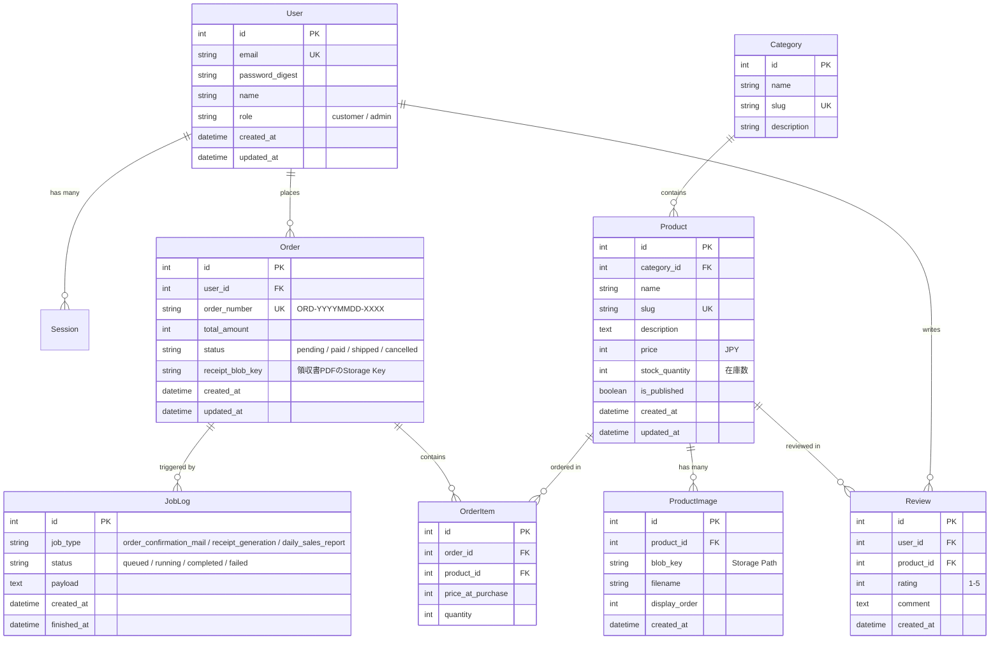

# 統合ECアプリケーション設計書: 「CraftCommerce」
**NuxtHub (Nuxt 4 / Cloudflare) vs Modern Rails (Rails 8 / Solid Trio) 比較検証用**

---

## 1. 概要とリアルなユースケース設定

### 1.1 サービス概要
**「CraftCommerce（クラフト・コマース）」** は、こだわりのクラフト商品やデジタルグッズを販売するモダンなEコマースプラットフォームです。

一般的なCRUDアプリと異なり、ECサイトは **「画像配信」「高速キャッシュ」「一時カート(KV)」「トランザクション整合性」「非同期処理(メール/PDF)」「リアルタイム在庫更新」** など、Web開発におけるあらゆる技術要素が複合的に求められる最も実践的で比較に適したユースケースです。

### 1.2 本ユースケースで検証するコア課題
1. **高速な商品閲覧体験**: トップ・一覧・商品詳細をミリ秒単位で返すエッジ/サーバーキャッシュ
2. **高速なカート・閲覧履歴**: RDBMSに負荷をかけないKV（Key-Value）による一時データ管理（ゲスト/会員対応・ログイン時自動マージ）
3. **安全な購入・在庫管理**: 在庫の引き当てと注文データのトランザクション整合性
4. **メディアと帳票処理**: 商品画像（複数アップロード・最適化）と購入後の領収書PDF生成（`pdf-lib` / `prawn`）・保存
5. **バックグラウンドジョブ**: 注文完了メール通知（ログ/JobLog記録）、決済シミュレーション、日次売上集計
6. **リアルタイム在庫・売上速報**: フラッシュセール時の在庫カウントダウンや管理者向け注文リアルタイム速報（Solid Cable vs SSE）

---

## 2. 技術スタック対照表（和集合マッピング）

| 機能コンポーネント | ECサイトでの具体的ユースケース | Modern Rails (Rails 8) | NuxtHub (Nuxt 4 + CF) |
| :--- | :--- | :--- | :--- |
| **商品カタログ / SSR** | 商品詳細・一覧のSEO & 超高速レンダリング | Hotwire (Turbo Drive + Morphing) | Vue 3 + Nuxt 4 SSR |
| **商品データ & 注文** | ユーザー、商品、在庫、注文トランザクション | SQLite3 + ActiveRecord (トランザクション) | Cloudflare D1 (SQLite) + Drizzle ORM |
| **カート & 閲覧履歴** | ゲスト/会員の高速カート保持、最近見た商品 | `Solid Cache` / KV テーブル | Cloudflare KV (`hubKV()`) |
| **画像 & 領収書PDF** | 商品ギャラリー画像、購入後のPDF領収書保管 | Active Storage (Local Disk / S3互換) + `prawn` | Cloudflare R2 (`hubBlob()`) + `pdf-lib` |
| **バックグラウンド処理** | 注文完了メール送信、PDF生成、売上集計バッチ | `Solid Queue` + Active Job (ログ記録) | Cloudflare Queues / Nitro Tasks (ログ記録) |
| **カタログキャッシュ** | トップ・商品一覧の高速エッジキャッシュ配信 | `Solid Cache` (`Rails.cache.fetch`) | Nitro Cache (`defineCachedEventHandler`) |
| **在庫ライブ同期** | 残り在庫数のリアルタイム更新、管理者注文速報 | `Solid Cable` + Turbo Streams | Server-Sent Events (SSE: Nitro event-stream) |
| **認証 & 権限** | 一般顧客アカウント & 管理者 (Admin) ダッシュボード | Rails 8 組み込み認証 + Role制御 | 暗号化 Cookie (`h3 sealSession`) + Role |
| **DB管理・運用** | 在庫確認、クエリチューニング、データメンテナンス | Harlequin TUI (`.harlequin.toml`) | Nuxt DevTools (D1 Hub Editor) |
| **テスト & 品質管理** | 単体・統合テスト、静的解析・型チェック | Minitest (`bin/rails test`) + RuboCop | Vitest + `@nuxt/test-utils` + Oxlint/Oxfmt |
| **デプロイ・インフラ** | 本番稼働構成 | Kamal 2 (単一VPS / コンテナ) | Pulumi (TypeScript) + Cloudflare Pages |

---

## 3. データモデル & データベース設計

### 3.1 ER図 (Entity-Relationship)



---

## 4. 詳細機能要件 (ECサイト・和集合仕様)

### 4.1 顧客向けフロント機能
1. **トップページ & カタログ閲覧 (Cache & SSR)**:
   - 特集バナー、おすすめ商品、新着商品、カテゴリ別一覧
   - **キャッシュ戦略**: 商品カタログは 60秒キャッシュ（商品情報変更時に即座にパージ）
2. **商品詳細 & リアルタイム在庫 & レビュー**:
   - 複数ギャラリー画像のカルーセル/グリッド表示
   - 在庫状況（「残りわずか」「在庫あり」「在庫切れ」）
   - **リアルタイム更新**: 他のユーザーが購入して在庫が変動した際、画面をリロードせずに残り在庫表示が自動更新（Rails: Solid Cable / Nuxt: SSE）
   - **レビュー機能**: ログインユーザーによる星評価（1〜5）とコメント投稿、レビュー平均点および一覧の表示
3. **ショッピングカート (KV Store活用)**:
   - **キー設計 & TTL**:
     - ゲスト（未ログイン）: Cookie で `guest_session_id` (UUID) を発行し、KV に `cart:guest_<uuid>` で保存（TTL: 7日間）
     - 会員（ログイン済）: KV に `cart:user_<id>` で保存（TTL: 30日間）
   - **カートマージ**: ゲスト状態で商品をカートに入れたままログイン/新規会員登録した場合、ゲストカートの全アイテムを会員カートへ自動統合（マージ）し、ゲストカートKVを削除
   - **データ構造**: `{ items: [{ productId: number, quantity: number, priceAtAdd: number }] }`
   - RDBMSに毎回書き込まず、KV Storeで超高速読み書き
4. **チェックアウト & 注文処理 (Transaction & Mock Payment)**:
   - カート内容の確認 → 「注文を確定する」ボタン押下
   - **決済シミュレーション**: 外部決済連携は行わず、モック決済として即座に `status: 'paid'`（決済完了）として注文確定
   - **在庫引き当て**: DBトランザクション内で在庫を安全に減算し、注文レコード (`Order`, `OrderItem`) を生成
   - 購入完了と同時に非同期ジョブをキューへ投入（サンクスメール送信 & 領収書PDF生成）
5. **マイページ & 注文履歴 (PDFダウンロード)**:
   - 過去の注文履歴一覧・注文明細
   - **領収書PDFダウンロード**:
     - **NuxtHub**: 純粋な JS ライブラリ [`pdf-lib`](https://pdf-lib.js.org/) を用いて Workers 上でバイナリ生成し Cloudflare R2 (`hubBlob()`) に保存
     - **Rails**: `prawn` gem を用いて PDF を生成し Active Storage に保存
     - 生成されたPDFを安全にストリーミングダウンロード
6. **最近チェックした商品 (KV Store)**:
   - ユーザーが閲覧した商品の履歴（直近6件）をKV（`recently_viewed:guest_<uuid>` / `recently_viewed:user_<id>`）に保存し、画面下部に即座にカルーセル表示

### 4.2 管理者 (Admin) 向けバックオフィス機能
1. **商品管理 (CRUD & 画像アップロード)**:
   - 商品の新規登録、価格・在庫編集、公開/非公開トグル
   - カテゴリは初期シードデータからドロップダウン選択（AdminでのカテゴリCRUDはスコープ外）
   - 商品画像のドラッグ＆ドロップ複数アップロード（R2 / Active Storage）
2. **注文管理 & リアルタイム売上速報**:
   - 注文一覧、ステータス変更（「発送準備中」→「発送済み」）
   - **リアルタイム通知**: 新しい注文が入った瞬間に管理画面にトースト通知 & 売上カウンタが自動インクリメント（Rails: Solid Cable / Nuxt: SSE）
3. **非同期ジョブ監視 & バッチ実行 (`/admin/jobs`)**:
   - 実行されたジョブ（メール送信、PDF生成、日次集計）のログ一覧・成功/失敗ステータス
   - **メール送信ジョブ**: 開発・検証環境ではログ出力（Rails: ログ/letter_opener, NuxtHub: console.log/モック）を行い、`JobLog` テーブルに記録
   - 「日次売上集計ジョブ」の手動トリガー実行ボタン
4. **キャッシュ管理 (`/admin/cache`)**:
   - トップページ・カタログのキャッシュ状況確認
   - ワンクリックでの全キャッシュクリア（Purge）

---

## 5. 画面設計 & ページ構成

```text
[顧客向け]
/                           # トップページ (特集バナー・おすすめ商品・キャッシュ)
/products                   # 商品一覧 (カテゴリ絞り込み・検索)
/products/:slug             # 商品詳細 (画像ギャラリー・在庫ライブ表示・カート追加・レビュー一覧&投稿)
/cart                       # ショッピングカート画面 (KV連動)
/checkout                   # 購入確認・チェックアウト (モック決済)
/orders/:id/complete        # 注文完了画面
/mypage/orders              # 注文履歴一覧 (領収書PDFダウンロード)
/login, /signup             # ログイン・新規会員登録 (ゲストカートの自動マージ)

[管理者向け]
/admin                      # 売上ダッシュボード (リアルタイム注文更新)
/admin/products             # 商品管理一覧
/admin/products/new         # 商品登録 (画像アップロード・カテゴリ選択)
/admin/orders               # 注文管理・発送ステータス更新
/admin/jobs                 # バックグラウンドジョブ監視・手動集計実行
/admin/cache                # キャッシュパージ・ステータス確認
```

---

## 6. API & エンドポイント設計

```text
[Auth]
POST   /api/auth/register            # 会員登録 (ゲストカートがあればマージ)
POST   /api/auth/login               # ログイン (ゲストカートがあればマージ)
POST   /api/auth/logout              # ログアウト
GET    /api/auth/me                  # ログイン情報 & Role

[Catalog / Cache]
GET    /api/products                 # 商品一覧 (Cached: 60s)
GET    /api/products/:slug           # 商品詳細 (Cached: 60s)
GET    /api/categories               # カテゴリ一覧

[Reviews]
GET    /api/products/:slug/reviews   # 商品レビュー一覧 (商品詳細APIに内包可)
POST   /api/products/:slug/reviews   # レビュー投稿 (要認証: 1-5星, コメント)

[Cart / KV]
GET    /api/cart                     # カート内容取得 (KV: ゲスト/会員セッション判定)
POST   /api/cart/items               # カートに商品追加 (KV)
PATCH  /api/cart/items/:id           # 数量変更 (KV)
DELETE /api/cart/items/:id           # カートから削除 (KV)
GET    /api/user/recently-viewed     # 閲覧履歴取得 (KV)

[Checkout & Orders]
POST   /api/orders                   # 注文確定 (DB Transaction + モック決済 + Queue ジョブ発行)
GET    /api/orders/my                # 自分の注文履歴
GET    /api/orders/:id/receipt       # 領収書PDFストリーミング (R2 / Active Storage)

[Realtime (NuxtHub / SSE)]
GET    /api/realtime/inventory       # 商品在庫ライブ同期用 SSE エンドポイント
GET    /api/realtime/admin-orders    # 管理者向け注文速報 SSE エンドポイント
(※ Rails 側は Solid Cable / Action Cable WebSocket チャンネルで実装)

[Admin]
POST   /api/admin/products           # 商品作成 (Multipart: 画像アップロード)
PATCH  /api/admin/products/:id       # 商品編集 (在庫変更・キャッシュパージ連動)
GET    /api/admin/orders             # 全注文一覧
PATCH  /api/admin/orders/:id/status  # 発送ステータス変更
POST   /api/admin/jobs/daily-report  # 売上集計ジョブトリガー
GET    /api/admin/jobs/logs          # ジョブ実行ログ
POST   /api/admin/cache/purge        # カタログキャッシュ破棄
```

---

## 7. 初期シードデータ & アカウント仕様

両リポジトリで同等の初期データを用意し、同一条件で検証・操作できるようにします。

### 7.1 初期アカウント
| 権限 | Email | Password | 備考 |
| :--- | :--- | :--- | :--- |
| **管理者 (Admin)** | `admin@example.com` | `password123` | 管理画面 (`/admin`) へのアクセス権限 |
| **一般会員 (Customer)** | `user@example.com` | `password123` | 商品購入・注文履歴・レビュー投稿用 |

### 7.2 初期カテゴリ & 商品構成
- **カテゴリ (Category)**:
  1. `craft-art` (クラフト・雑貨)
  2. `woodwork` (木工家具)
  3. `ceramics` (陶芸・ガラス)
  4. `leather` (レザーアイテム)
  5. `digital` (デジタルアート・フォント)
- **初期商品**:
  - 各カテゴリ 1〜2件（計 6〜8 件）
  - 各商品にダミー画像（1〜3枚）、価格（1,000円〜25,000円）、初期在庫数（2〜15個）、初期レビューを登録

---

## 8. 実装・比較検証シナリオ (Benchmark Matrix)

| 検証項目 | 検証シナリオ・テスト内容 | 注目メトリクス |
| :--- | :--- | :--- |
| **① エッジ/SSR性能** | トップページ・商品詳細への同時100リクエスト | 初回TTFB、キャッシュヒット時のレイテンシ (ms) |
| **② カート操作 (KV vs DB)** | カート追加・数量変更の高速連打 | レスポンス速度、DBへの負荷（クエリ発行数ゼロか） |
| **③ 在庫整合性と排他制御** | 残り在庫1個の商品に対する同時購入リクエスト | デッドロック有無、二重購入防止、整合性維持 |
| **④ 画像アップロード & 配信** | 4K高解像度商品画像（5MB×3枚）のアップロード | アップロード所要時間、配信レイテンシ、サムネイル処理 |
| **⑤ ジョブ耐障害性** | 領収書PDF生成・メール送信ジョブの並行実行 | キュー処理スループット、失敗時リトライ挙動 |
| **⑥ リアルタイム通知** | 別端末で注文確定時の管理画面ライブ更新 | WebSocket/SSEの接続維持負荷、通知ディレイ |
| **⑦ 開発工数 & 型安全性** | 商品モデルに「セール価格 (`sale_price`)」を追加する改修 | スキーマ変更からUI・API反映までの修正箇所・型チェック |

---

## 9. テスト仕様 & 品質保証 (Testing & QA Suite)

両リポジトリで同等のテストカバレッジを維持し、ビジネスロジックの正確性とリグレッション防止を担保します。

### 9.1 単体テスト (Unit / Model Tests)
1. **認証 & 認可 (Auth & Authorization)**:
   - パスワードハッシュ化・照合
   - ユーザーRole（Customer / Admin）の権限判定ヘルパー
2. **カートロジック (Cart Domain Logic)**:
   - カート内アイテムの追加・数量更新・削除
   - 小計 (Subtotal) および合計金額・合計点数の算出
   - ゲストカートから会員カートへのマージ処理ロジック
3. **在庫管理 & トランザクション (Inventory & Transaction)**:
   - 在庫十分時の正常減算
   - 在庫不足（0個または要求数未満）時の購入拒絶・例外送出
4. **領収書PDF生成 (Receipt Generation)**:
   - 注文明細データから正しいPDFバイナリが生成されること（`pdf-lib` / `prawn`）

### 9.2 API / 統合テスト (Integration / Request Tests)
1. **認証フロー**:
   - 会員登録、ログイン、ログアウト、セッション永続化
   - ログイン時のゲストカート引き継ぎ（マージ）
2. **カタログ & レビュー**:
   - `/api/products` 一覧取得・カテゴリ絞り込み
   - `/api/products/:slug` 詳細取得（キャッシュヘッダー確認）
   - レビュー投稿（ログイン必須、バリデーションエラー、平均評価の更新）
3. **ショッピングカート (KV)**:
   - ゲストセッションでのアイテム追加・数量変更・削除
   - 会員セッションでのアイテム追加・取得
4. **チェックアウト & 注文完了**:
   - カート内商品から注文確定 (`POST /api/orders`)
   - 在庫数の即時減算と `Order` / `OrderItem` の生成
   - 非同期ジョブ（メール送信ログ、PDF生成）のエンキュー確認
5. **管理機能 (Admin Protection)**:
   - 未認証 / Customer ユーザーによる管理者APIアクセス拒否 (`401` / `403`)
   - Admin ユーザーによる商品CRUD・ステータス更新
   - キャッシュパージAPIの動作

### 9.3 テスト実行コマンド & CI
| 項目 | Modern Rails | NuxtHub |
| :--- | :--- | :--- |
| **全テスト実行** | `bin/rails test` | `pnpm test` (`vitest run`) |
| **Linter / Formatter** | `bundle exec rubocop` | `pnpm lint` (`oxlint`) / `pnpm format` (`oxfmt`) |
| **型チェック** | - | `pnpm typecheck` (`vue-tsc`) |
| **CI一括検証** | `bin/rails test && bundle exec rubocop` | `pnpm check` (Oxfmt + Oxlint + Typecheck + Vitest) |

---

## 10. 実装後の振り返り & 技術比較レポート作成要件

両リポジトリでの実装完了後、客観的な比較検証結果と開発体験の総括として **技術比較・実装振り返りレポート**（`benchmark-specs/craft_commerce_report.md` および各リポジトリの `docs/IMPLEMENTATION_REPORT.md`）を作成します。

### 10.1 レポートに記載する必須項目

1. **実装で難しかった点・苦労した点 (Challenges & Pitfalls)**:
   - **NuxtHub / Cloudflare**:
     - Workers 環境（V8 isolate）特有の制約（PDF生成ライブラリ選定、ファイルハンドリング等）
     - D1 / Drizzle ORM でのトランザクション整合性やマイグレーションの挙動
     - Server-Sent Events (SSE) / リアルタイム同期のステート管理やエッジ配信での考慮点
   - **Modern Rails**:
     - Rails 8 Solid Trio (`solid_cache`, `solid_queue`, `solid_cable`) の設定と挙動
     - Hotwire (Turbo Streams / Morphing / Stimulus) によるリアクティブUI構築の学習コスト・制約
     - SQLite3 の並行処理・WALモードでの書き込み競合とトランザクション制御

2. **各スタックの優れていた点・良かったこと (Pros & Strengths)**:
   - **開発効率 (DX)**: コードの書きやすさ、型推論・補完、ホットリロード速度、ボイラープレートの少なさ
   - **デバッグ・運用ツール**: `Nuxt DevTools (Hub UI)` vs `Harlequin TUI` / `Rails Console` の使い勝手
   - **機能統合度**: Batteries-Included なフレームワーク機能（認証・ジョブ・キャッシュ・ストレージ）の完成度

3. **アーキテクチャ・運用面での気づき (Architecture & Operations Insights)**:
   - **単一コンテナ自己完結 (Rails 8)** vs **完全サーバーレス・エッジ分散 (NuxtHub)** のトレードオフ
   - デプロイの容易性（Kamal 2 vs Pulumi + Cloudflare Pages）と初期セットアップコスト
   - コールドスタートやエッジレスポンス速度の実感

4. **ベンチマーク検証シナリオの実施結果 (Benchmark Findings)**:
   - 第8章の検証マトリクス（エッジ/SSR性能、KVカート連打、同時購入での在庫排他制御、ジョブ並行実行など）の実測値または検証結果まとめ

5. **総合評価 & 使い分けの指針 (Conclusion & Recommendation)**:
   - 「どういうユースケース・チーム構成であれば NuxtHub を選ぶべきか / Rails 8 を選ぶべきか」の実践的な選定基準


