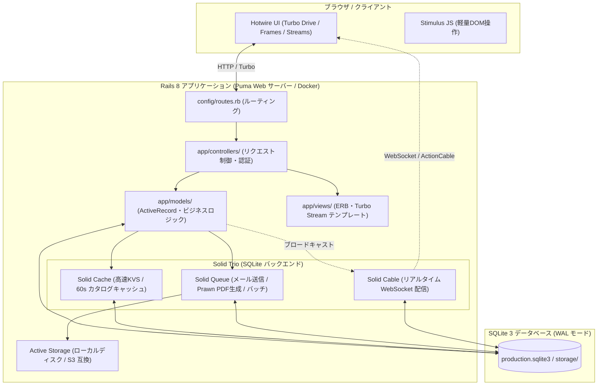
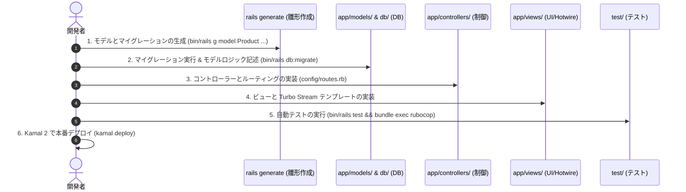

# 💎 【初心者向け】Modern Rails (Rails 8 + Solid Trio) アーキテクチャ & ディレクトリ構成完全入門

**「Redis も Sidekiq も Node.js も不要。Rails 8 と SQLite 3 だけで最高水準のフルスタックWebアプリを完結させる」**

本ドキュメントでは、Rails 8 の最新アーキテクチャである **「Solid Trio（Solid Cache / Queue / Cable）」**、**「Hotwire」**、**「Kamal 2」** を用いた開発の全体像、ディレクトリ構造、各ディレクトリに「どのようなコード・ファイルを書くべきか」、そして初心者向けの実践開発手順を徹底解説します。

---

## 🏗️ 1. Modern Rails 8 の全体アーキテクチャ概要

従来の Rails 開発では、キャッシュや WebSocket、非同期ジョブのために **Redis** や **Memcached**、**Sidekiq** などの外部ミドルウェアを個別にセットアップ・監視する必要がありました。

**Rails 8** では、SQLite 3 の高速な WAL（Write-Ahead Logging）モードを活用した **「Solid Trio」** が標準搭載され、**外部サーバーや複雑なミドルウェアなしに、Docker 1コンテナ / VPS 1台で全機能が自立稼働** します。



### 💡 主要コンポーネントと役割
1. **Puma**: Ruby の高速マルチスレッド Web サーバー。
2. **ActiveRecord**: リレーショナルデータベースの操作、バリデーション、関連付け、悲観的排他ロック（`Product.lock`）。
3. **Solid Cache**: Redis 不要で DB 上に構築される高速キャッシュ・Key-Value ストア（一時カート、SSR キャッシュ）。
4. **Solid Queue**: Sidekiq や Redis 不要の DB 駆動バックグラウンドジョブキュー（メール送信、PDF 生成）。
5. **Solid Cable**: Redis 不要で動作する Action Cable WebSocket ブロードキャスト（リアルタイム在庫同期、注文速報）。
6. **Hotwire (Turbo + Stimulus)**: フロントエンドの重厚な SPA フレームワークなしに、サーバー主導で高速・リアクティブな UI を実現。

---

## 📂 2. ディレクトリ構成と各ファイルの役割（どこに何を書くか）

Modern Rails プロジェクトの標準的なディレクトリツリーと、それぞれの配置責務です。

```text
modern-rails/
├── app/                        # 💎 アプリケーションの中核コード
│   ├── models/                 # データ構造・ビジネスロジック (ActiveRecord)
│   ├── controllers/            # リクエスト受付・認可・レスポンス制御
│   ├── views/                  # HTML テンプレート (ERB / Turbo Frames / Streams)
│   ├── javascript/             # フロントエンド JS (Stimulus コントローラー)
│   ├── jobs/                   # 非同期バックグラウンドジョブ (Solid Queue)
│   ├── channels/               # WebSocket 通信チャンネル (Solid Cable)
│   ├── mailers/                # メール送信用クラス・テンプレート
│   └── assets/                 # CSS (Tailwind CSS v4) や画像
│
├── config/                     # 🔧 アプリケーション・インフラ設定
│   ├── routes.rb               # URL ルーティング定義
│   ├── database.yml            # SQLite / DB 接続設定
│   ├── deploy.yml              # Kamal 2 本番デプロイ設定
│   └── environments/           # 環境別設定 (development, production, test)
│
├── db/                         # 🗄️ データベース管理
│   ├── migrate/                # テーブル作成・変更マイグレーションファイル
│   ├── schema.rb               # 現在の DB スキーマ定義
│   └── seeds.rb                # 初期データ投入スクリプト
│
├── storage/                    # 💾 SQLite DB ファイルおよび Active Storage 保存先
├── test/                       # 🧪 Minitest 自動テストスイート (models, integration 等)
├── Dockerfile                  # 🐳 本番コンテナビルド定義
├── compose.yaml                # 🛠️ 開発用 Docker Compose 設定
└── Gemfile                     # 📦 使用する Ruby gem ライブラリ一覧
```

---

## 📝 3. ディレクトリ別：書くべき内容とコード例

### ① `app/models/` (データモデル & ビジネスロジック)
* **書く内容**: データベーステーブルに対応するクラス。バリデーション、関連付け（`has_many`, `belongs_to`）、トランザクション、ドメイン計算ロジック。
* **コード例 (`app/models/product.rb`)**:
```ruby
class Product < ApplicationRecord
  belongs_to :category
  has_many :product_images, dependent: :destroy
  has_many :reviews, dependent: :destroy

  validates :name, presence: true
  validates :price, numericality: { greater_than_or_equal_to: 0 }
  validates :stock_quantity, numericality: { greater_than_or_equal_to: 0 }

  scope :published, -> { where(is_published: true) }

  # 安全な在庫引き当て (悲観的ロック)
  def decrement_stock!(quantity)
    with_lock do
      raise "在庫不足です" if stock_quantity < quantity
      update!(stock_quantity: stock_quantity - quantity)
    end
  end
end
```

---

### ② `app/controllers/` (リクエスト制御)
* **書く内容**: ルーティングから渡されたリクエストを受け取り、モデルを呼び出してビューや JSON を返す。
* **コード例 (`app/controllers/checkouts_controller.rb`)**:
```ruby
class CheckoutsController < ApplicationController
  before_action :authenticate_user!

  def create
    cart = current_cart
    
    ActiveRecord::Base.transaction do
      order = Order.create!(user: Current.user, total_amount: cart.total_amount)
      cart.items.each do |item|
        item.product.decrement_stock!(item.quantity)
        order.order_items.create!(product: item.product, quantity: item.quantity, price_at_purchase: item.price_at_add)
      end
      cart.clear
      
      # 非同期ジョブ投入 (Solid Queue)
      GenerateReceiptPdfJob.perform_later(order.id)
      redirect_to complete_order_path(order), notice: "注文が完了しました"
    end
  rescue => e
    redirect_to cart_path, alert: e.message
  end
end
```

---

### ③ `app/views/` (画面テンプレート & Hotwire)
* **書く内容**: HTML 構造（ERB）および Turbo Frames / Streams による部分更新定義。
* **コード例 (`app/views/products/show.html.erb`)**:
```erb
<div class="product-detail">
  <h1><%= @product.name %></h1>
  <p class="price">¥<%= number_with_delimiter(@product.price) %> (税込)</p>

  <!-- Turbo Streams によるリアルタイム在庫更新ターゲット -->
  <%= turbo_stream_from @product, :inventory %>
  <div id="<%= dom_id(@product, :stock) %>">
    <%= render "stock_badge", product: @product %>
  </div>

  <%= button_to "カートに追加", cart_items_path(product_id: @product.id), method: :post, class: "btn-primary" %>
</div>
```

---

### ④ `app/jobs/` (非同期バックグラウンド処理)
* **書く内容**: 時間のかかる処理（PDF 帳票生成、メール送信、外部 API 連携）を Solid Queue で非同期実行するクラス。
* **コード例 (`app/jobs/generate_receipt_pdf_job.rb`)**:
```ruby
class GenerateReceiptPdfJob < ApplicationJob
  queue_as :default

  def perform(order_id)
    order = Order.find(order_id)
    pdf_data = PrawnPdfGenerator.generate(order)
    
    # Active Storage に添付保存
    order.receipt_pdf.attach(
      io: StringIO.new(pdf_data),
      filename: "receipt-#{order.order_number}.pdf",
      content_type: "application/pdf"
    )
    JobLog.create!(job_type: "receipt_generation", status: "completed", payload: { order_id: order.id })
  end
end
```

---

### ⑤ `app/channels/` (WebSocket リアルタイム配信)
* **書く内容**: Solid Cable を使った双方向通信や、クライアントへのイベントブロードキャスト。
* **コード例 (`app/channels/inventory_channel.rb`)**:
```ruby
class InventoryChannel < ApplicationCable::Channel
  def subscribed
    product = Product.find(params[:product_id])
    stream_for product
  end
end
```

---

## 🛠️ 4. 初心者が新機能を追加する際の実践開発フロー



1. **ステップ 1: モデルの生成** (`bin/rails generate model Product name:string price:integer ...`)
2. **ステップ 2: DB 反映** (`bin/rails db:migrate` で SQLite にテーブル作成)
3. **ステップ 3: コントローラー & ルーティング定義** (`config/routes.rb` に `resources :products` を追加)
4. **ステップ 4: ERB / Hotwire ビュー作成** (`app/views/products/` に画面を作成)
5. **ステップ 5: テスト & コード検証** (`bin/rails test` と `bundle exec rubocop` を実行)
6. **ステップ 6: 本番デプロイ** (`kamal deploy` で VPS へゼロダウンタイム反映)

---

## 🎯 5. まとめ

* **データとビジネスロジック** ➔ `app/models/`
* **画面とリクエスト制御** ➔ `app/controllers/` と `app/views/`
* **時間のかかる重い処理** ➔ `app/jobs/` (Solid Queue)
* **リアルタイムライブ更新** ➔ `app/channels/` (Solid Cable)
* **テストとコード規約** ➔ `test/` (Minitest) と RuboCop

Rails 8 は「Convention over Configuration（設定より規約）」の理念のもと、**迷わずコードを書く場所が決まっており、かつ Solid Trio によって外部依存のない驚異的なシンプルさ** を実現しています。
