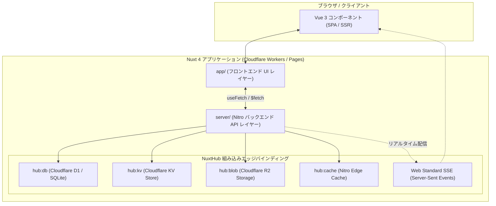
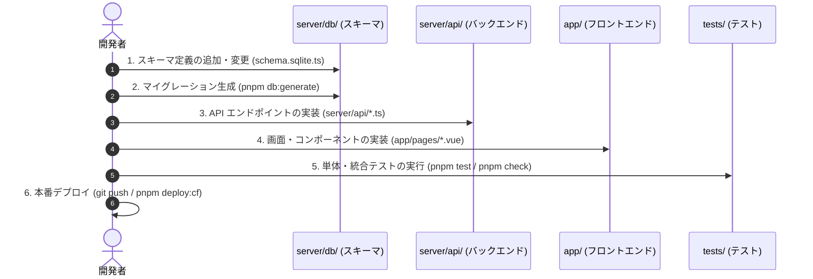

# 🚀 【初心者向け】NuxtHub (Nuxt 4 + Cloudflare) アーキテクチャ & ディレクトリ構成完全入門

**「Vue / Nuxt のフロントエンド知識だけで、Cloudflare の高性能サーバーレスバックエンドまで一気通貫で開発する」**

本ドキュメントでは、Nuxt 4 と NuxtHub を組み合わせたフルスタック Web アプリケーションの全体アーキテクチャ、ディレクトリ構造、各ディレクトリに「どのようなコード・ファイルを書くべきか」、そして初心者向けの開発手順をわかりやすく解説します。

---

## 🏗️ 1. NuxtHub の全体アーキテクチャ概要

従来の Web 開発では、フロントエンド（Vue/React）、バックエンド API（Node.js/Go/Ruby）、データベース（PostgreSQL/MySQL）、KVS（Redis）、オブジェクトストレージ（AWS S3）などを個別に構築・管理する必要がありました。

**NuxtHub** は、Cloudflare のエッジインフラを Nuxt 4 に統合し、**外部サーバーや SaaS の契約なしに、Nuxt プロジェクト単体ですべてのインフラ機能を提供** します。



### 💡 主要コンポーネントと役割
1. **フロントエンド (Vue 3 SFC + Nuxt 4)**: SSR（サーバーサイドレンダリング）とクライアント側リアクティビティを自動両立。
2. **バックエンド (Nitro サーバーエンジン)**: `server/api/` にファイルを置くだけで自動ルーティングされる超軽量サーバーレス API。
3. **データベース (`hub:db`)**: Cloudflare D1（分散型 SQLite）+ Drizzle ORM による型安全なリレーショナル DB。
4. **KVS (`hub:kv`)**: 読み込みミリ秒未満のグローバル Key-Value ストア（一時カート、閲覧履歴、セッション）。
5. **ストレージ (`hub:blob`)**: Cloudflare R2（S3 互換の画像・PDF・ファイル保存ストレージ）。

---

## 📂 2. ディレクトリ構成と各ファイルの役割（どこに何を書くか）

NuxtHub プロジェクトの標準的なディレクトリツリーと、それぞれの配置責務です。

```text
try-nuxthub/
├── app/                        # 🎨 フロントエンド (UI / Vue レイヤー)
│   ├── app.vue                 # ルートコンポーネント (全ページ共通の枠組み)
│   ├── components/             # 再利用可能な Vue コンポーネント
│   ├── composables/            # 状態管理・カスタムフック (useCart, useAuth 等)
│   ├── layouts/                # ページ共通レイアウト (default.vue, admin.vue 等)
│   └── pages/                  # ファイルベースルーティングの画面ファイル
│
├── server/                     # ⚙️ バックエンド (Nitro サーバー API レイヤー)
│   ├── api/                    # REST API エンドポイント (/api/*)
│   ├── db/                     # Drizzle ORM スキーマ & マイグレーション SQL
│   ├── utils/                  # サーバー側共通ヘルパー (PDF生成、認証、暗号化)
│   └── assets/                 # サーバー側静的アセット (フォントファイル等)
│
├── public/                     # 🌐 クライアント直接配信の静的ファイル (favicon, robots.txt)
├── tests/                      # 🧪 自動テストスイート (Vitest + @nuxt/test-utils)
│   ├── unit/                   # 単体テスト
│   └── integration/            # API 結合・E2E テスト
│
├── infra/                      # ☁️ Pulumi (TypeScript) による本番インフラ定義 (IaC)
├── nuxt.config.ts              # 🔧 Nuxt & NuxtHub の全体設定ファイル
├── wrangler.toml               # ⚡ Cloudflare Workers / D1 バインディング設定
└── package.json                # 📦 依存パッケージと実行スクリプト
```

---

## 📝 3. ディレクトリ別：書くべき内容とコード例

### ① `app/pages/` (画面・ページ)
* **書く内容**: URL パスに対応する Vue コンポーネント。ファイル名がそのままルーティングになります。
* **命名ルール**:
  * `pages/index.vue` ➔ `/` (トップページ)
  * `pages/products/index.vue` ➔ `/products` (商品一覧)
  * `pages/products/[slug].vue` ➔ `/products/sample-item` (商品詳細・動的ルート)
* **コード例 (`app/pages/products/[slug].vue`)**:
```vue
<script setup lang="ts">
const route = useRoute();
// サーバー API (server/api/products/[slug].get.ts) を型安全に呼び出す
const { data: product, error } = await useFetch(`/api/products/${route.params.slug}`);
const { addToCart } = useCart();
</script>

<template>
  <div v-if="product" class="product-detail">
    <h1>{{ product.name }}</h1>
    <p class="price">¥{{ product.price.toLocaleString() }} (税込)</p>
    <button @click="addToCart(product.id, 1)">カートに追加</button>
  </div>
</template>
```

---

### ② `app/composables/` (フロントエンドの状態管理・ロジック)
* **書く内容**: 複数画面で共有する状態（カート情報、ユーザー認証情報、SSE購読など）のカスタムフック。
* **コード例 (`app/composables/useCart.ts`)**:
```ts
export const useCart = () => {
  const cart = useState("cart", () => ({ items: [], totalCount: 0 }));

  const fetchCart = async () => {
    cart.value = await $fetch("/api/cart");
  };

  const addToCart = async (productId: number, quantity: number) => {
    cart.value = await $fetch("/api/cart/items", {
      method: "POST",
      body: { productId, quantity },
    });
  };

  return { cart, fetchCart, addToCart };
};
```

---

### ③ `server/api/` (バックエンド API エンドポイント)
* **書く内容**: データベース（D1）、KV、ストレージ（R2）を操作する HTTP API ハンドラ。
* **命名ルール**: `[名前].[HTTPメソッド].ts` で定義（例: `items.post.ts`, `[id].delete.ts`）。
* **コード例 (`server/api/cart/items.post.ts`)**:
```ts
import { kv } from "hub:kv";

export default defineEventHandler(async (event) => {
  const body = await readBody(event);
  const session = await getUserSession(event); // 暗号化 Cookie からユーザー取得
  
  // 会員なら cart:user_123, ゲストなら cart:guest_uuid
  const cartKey = session?.user ? `cart:user_${session.user.id}` : `cart:guest_${getGuestId(event)}`;
  
  const currentCart = (await kv.getItem(cartKey)) || { items: [] };
  currentCart.items.push({ productId: body.productId, quantity: body.quantity });
  
  await kv.setItem(cartKey, currentCart, { ttl: 60 * 60 * 24 * 7 }); // 7日間保存
  return currentCart;
});
```

---

### ④ `server/db/schema.sqlite.ts` (データベーススキーマ)
* **書く内容**: Drizzle ORM を使ったテーブル定義。ここから TypeScript の型が自動生成されます。
* **コード例**:
```ts
import { sqliteTable, text, integer } from "drizzle-orm/sqlite-core";

export const products = sqliteTable("products", {
  id: integer("id").primaryKey({ autoIncrement: true }),
  name: text("name").notNull(),
  slug: text("slug").notNull().unique(),
  price: integer("price").notNull(),
  stockQuantity: integer("stock_quantity").notNull().default(0),
  createdAt: integer("created_at", { mode: "timestamp" }).notNull().$defaultFn(() => new Date()),
});
```

---

### ⑤ `server/utils/` (サーバー側ユーティリティ)
* **書く内容**: サーバー側でのみ使用する共通処理（PDF 帳票生成、画像処理、メール送信モックなど）。
* **コード例 (`server/utils/pdf.ts`)**:
```ts
import { PDFDocument } from "pdf-lib";

export async function generateReceiptPdf(orderData: any): Promise<Uint8Array> {
  const pdfDoc = await PDFDocument.create();
  const page = pdfDoc.addPage([595.28, 841.89]); // A4
  page.drawText(`領収書: ${orderData.orderNumber}`, { x: 50, y: 800 });
  return await pdfDoc.save();
}
```

---

## 🛠️ 4. 初心者が新機能を追加する際の実践開発フロー



1. **ステップ 1: DB スキーマの定義** (`server/db/schema.sqlite.ts` にテーブル追加)
2. **ステップ 2: マイグレーションの実行** (`pnpm db:generate` でローカル D1 に反映)
3. **ステップ 3: バックエンド API 作成** (`server/api/` に `get.ts` や `post.ts` を追加)
4. **ステップ 4: フロント画面作成** (`app/pages/` で `useFetch` を使って UI を実装)
5. **ステップ 5: コード検証** (`pnpm check` で Oxlint + Oxfmt + 型チェック + Vitest を一括実行)
6. **ステップ 6: デプロイ** (GitHub への push で Cloudflare Pages へ自動リリース)

---

## 🎯 5. まとめ

* **画面とUIロジック** ➔ `app/` 配下（pages, components, composables）
* **API・DB操作・サーバー処理** ➔ `server/` 配下（api, db, utils）
* **静的画像・ファイル** ➔ `public/` または R2 (`hub:blob`)
* **テストと品質管理** ➔ `tests/` と `pnpm check` (Oxlint / Oxfmt / Vitest)

フロントエンドとバックエンドの境界が Nitro と TypeScript によってシームレスに統合されており、**1つの言語・1つのフレームワークで完全なWebシステムを爆速で構築できる** のが NuxtHub の最大の魅力です。
