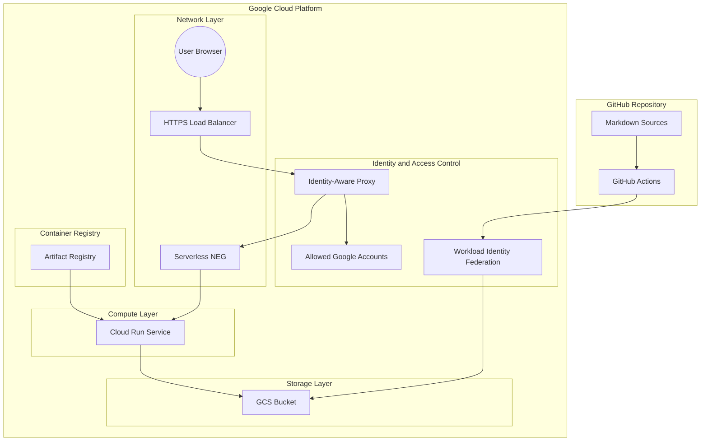

# GCP + Cloud Run (GCS Volume Mount) + IAP 構成設計書

本ドキュメントは、GitHub リポジトリに Push された Markdown ドキュメントを自動ビルド・GCS 同期し、Google Cloud Platform (GCP) 上で IAP 認証を介して特定グループ限定で配信するシステムの設計書です。

---

## 1. システムアーキテクチャ概要



---

## 2. ディレクトリ・リポジトリ構造

カレントディレクトリ（`/home/oharato/workspace/try-gcp/`）直下に、以下の 2 つのリポジトリ用ディレクトリおよび本設計書を作成します。

```text
try-gcp/
├── ARCHITECTURE.md            # 本設計ドキュメント
├── docs-repo/                 # ドキュメント管理・CI/CDリポジトリ
│   ├── .github/
│   │   └── workflows/
│   │       └── deploy.yml    # GHA: MkDocsビルド & GCS同期ワークフロー
│   ├── docs/                  # Markdown ドキュメント類
│   │   └── index.md
│   ├── mkdocs.yml            # MkDocs 設定ファイル
│   └── README.md
│
└── infra-terraform/           # GCP インフラ管理リポジトリ (Terraform)
    ├── .github/
    │   └── workflows/
    │       └── terraform.yml # GHA: PR時Plan結果コメント & mainマージ時Apply実行
    ├── main.tf                # メインプロバイダ & モジュール呼出
    ├── variables.tf           # 入力変数定義 (プロジェクトID、グループメールアドレス等)
    ├── outputs.tf             # 出力値 (WIFプロバイダ名、LB IP、GCSバケット名等)
    ├── terraform.tfvars.example # 変数設定例
    ├── modules/
    │   ├── wif/               # Workload Identity Federation
    │   ├── gcs/               # GCS バケット & IAM
    │   ├── artifact_registry/ # Nginx 用コンテナリポジトリ
    │   ├── cloud_run/         # Cloud Run (GCS Direct Volume Mount 設定)
    │   └── lb_iap/            # Global HTTPS Load Balancer + Serverless NEG + IAP
    └── dockerfiles/
        └── nginx/
            └── default.conf   # GCSマウントパスを参照するNginx設定
```

---

## 3. 主要コンポーネント設計仕様

### 3.1 GCS (Google Cloud Storage)
- **バケット用途**: ビルド済み静的コンテンツ (HTML/CSS/JS) の格納。
- **セキュリティ**:
  - パブリックアクセスの防止 (`public_access_prevention = "enforced"`).
  - 均一なバケットレベルのアクセス (`uniform_bucket_level_access = true`).
  - 非最新オブジェクトを 30 日後に自動削除するライフサイクルルールを設定 (`lifecycle_rule`).
  - GCS Fuse マウント用として Cloud Run サービスアカウントに `roles/storage.objectViewer` 権限を付与。
  - GitHub Actions デプロイ用 SA に `roles/storage.objectAdmin` 権限を付与。

### 3.2 Cloud Run + Nginx + Volume Mount
- **Docker コンテナ**: `nginx:1.27.5-alpine3.21` ベースイメージを使用し、非 root ユーザー (`nginx`) 権限で安全に起動。
- **セキュリティ強化**: `server_tokens off;` によるバージョン隠蔽、gzip 圧縮、および Content-Security-Policy 含む包括的なセキュリティヘッダーを Nginx 設定で常時適用。
- **GCS Volume Mount**:
  - Cloud Run の第二世代実行環境 (Second Generation execution environment) および Cloud Storage ボリュームマウント機能を利用。
  - バケット `gs://docs-storage-bucket` をコンテナ内の `/usr/share/nginx/html` に Mount。
  - Nginx は `/usr/share/nginx/html` の静的ファイルをレスポンス。
- **認可制御**: Cloud Run の `allUsers` 直呼び出し権限を排除し、IAP サービスアカウント経由の `roles/run.invoker` のみに厳格化。

### 3.3 IAP (Identity-Aware Proxy) & Load Balancer
- **構成**: Global External HTTP(S) Load Balancer + Serverless NEG + IAP.
- **HTTP/HTTPS 制御**: HTTP (ポート 80) 通信はすべて HTTPS (ポート 443) へ強制リダイレクト (`google_compute_url_map.http_redirect`) させ、未暗号化アクセスによる IAP バイパスリスクを遮断。
- **OAuth 同意画面**:
  - 個人アカウント（組織なし）の場合、User Type（ユーザーの種類）を **外部 (External)** に設定。
  - 公開ステータスは **テスト (Testing)** のままとし、**テストユーザー** に許可する Gmail アカウント（自分や友人）を登録。
- **認証・認可ポリシー**:
  - 指定した個人の Google アカウントリスト (`allowed_users`) に対して `roles/iap.httpsResourceAccessor` ロールを付与。
  - 非認証リクエストおよび許可リスト外のユーザーは GCP ログイン画面経由で拒否。
  - IAP サービスアカウント (`service-<project_number>@gcp-sa-iap.iam.gserviceaccount.com`) が Cloud Run を透過呼出できるよう `google_project_service_identity` によりプロビジョニングし、`roles/run.invoker` 権限をバインド。

### 3.4 GitHub Actions & Workload Identity Federation (WIF)
サービスアカウントキーの JSON ファイルを発行せず、WIF を用いて GitHub リポジトリからのアクセスを安全に認証します。

1. **最小権限原則 (Least Privilege)**:
   - CI/CD サービスアカウントには `roles/owner` や `roles/editor` などの過剰権限を一切付与せず、Terraform のリソース制御に必要な 8 つの特定権限 (`roles/run.admin`, `roles/compute.admin`, `roles/storage.admin` 等) のみをバインド。

2. **ドキュメント自動デプロイ (`docs-repo/.github/workflows/deploy.yml`)**:
   - `main` ブランチへ Push 時に発動。
   - Python 3.12 環境で `requirements.txt` (`mkdocs-material`, `mkdocs-minify-plugin`) から依存ライブラリを固定バージョンでインストール。
   - `mkdocs build` で HTML/CSS/JS を自動最適化・ミニファイ出力。
   - `gcloud storage rsync --recursive --delete-unmatched-destination-objects site/ gs://<BUCKET_NAME>` で GCS へ差分同期。

3. **インフラ CI/CD 自動化 (`infra-terraform/.github/workflows/terraform.yml`)**:
   - **Pull Request (MR) 作成・更新時**: `terraform plan` を実行し、実行結果を PR のコメント欄に自動投稿。
   - **`main` ブランチへの Merge (Push) 時**: `terraform apply -auto-approve` を自動実行し、GCP インフラに即時反映。`concurrency` 制御により同時実行による State ロックを防止。
   - **一時ファイルの安全破棄**: 実行用に一時生成された `terraform.tfvars` はワークフローの最終ステップで `if: always()` により確実に自動消去。
   - **パス除外制御 (`paths-ignore`)**: `.md` などの非インフラファイルの更新時にはワークフローをスキップし、不要な `apply` を回避。

---

## 4. 構築・運用手順

1. **GCP 事前準備**: GCP プロジェクトの作成、Billing 設定、IAP OAuth 同意画面（外部 / テストモード）の設定、および必要な API (`compute`, `run`, `iam`, `artifactregistry`, `storage`, `iap`, `sts`, `cloudresourcemanager`) の有効化。
2. **Terraform によるインフラデプロイ (`infra-terraform`)**:
   - GCS リモートバックエンド (`gs://<project_id>-tfstate`) によりローカルと CI/CD Runner 間の状態 (State) を共有・同期
   - ローカルからの初回実行時は `gcloud auth application-default login` を実行
   - `terraform init && terraform apply`
   - GCS, WIF, Cloud Run, LB, IAP, SSL Cert が一元作成されます。
3. **外部 DNS での A レコード追加**:
   - お持ちのドメイン管理サービス（お名前.com / Cloudflare / Route 53 等）で、Terraform の出力 `load_balancer_ip` を A レコードとして登録。
   - レコード追加後、Google-managed SSL 証明書が自動発行・バインドされます。
4. **GitHub リポジトリ連携 (`docs-repo` & `infra-terraform`)**:
   - Terraform の output から WIF Provider 名および SA メールアドレスを取得し、GitHub Secrets (`GCP_WORKLOAD_IDENTITY_PROVIDER`, `GCP_SERVICE_ACCOUNT`) に設定。
   - PR でインフラ変更の `terraform plan` を確認後、Merge で自動 `apply` 適用。
   - ドキュメントリポジトリに Markdown を Push すると GCS へ自動反映。
5. **AI 開発支援 (MCP サーバー構成)**:
   - `.agents/mcp_config.json` に `@google-cloud/gcloud-mcp` および `@modelcontextprotocol/server-fetch` を登録し、AI アシスタントが GCP リソース・公式ドキュメントを参照可能な環境を提供。
